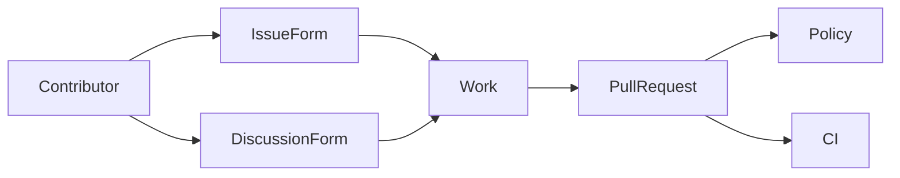
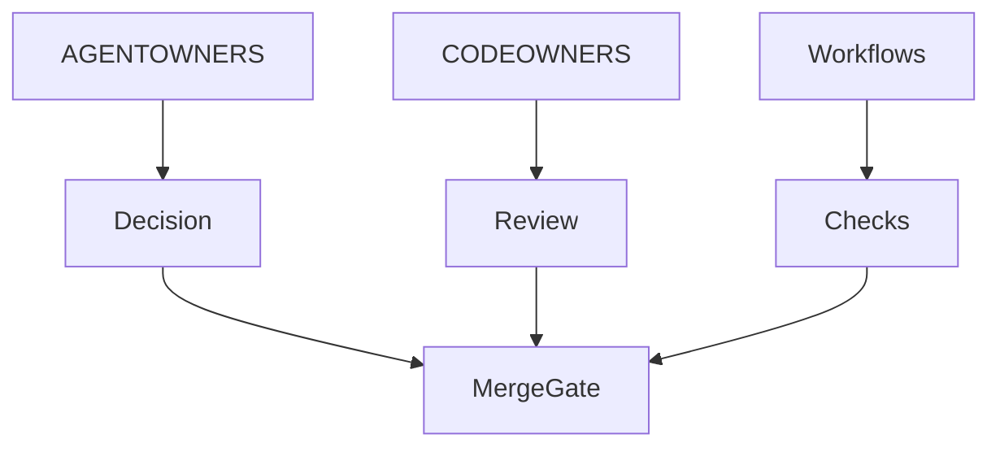
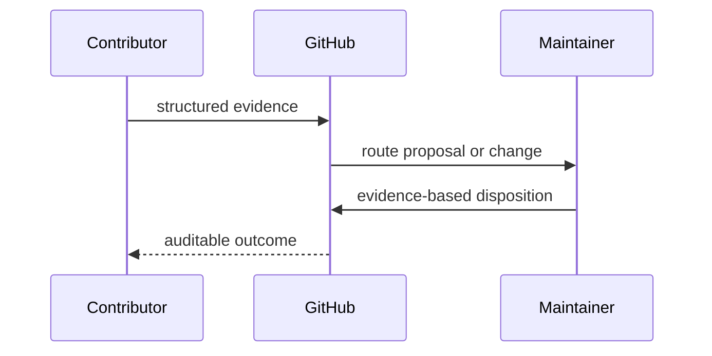

# GitHub Community and Automation

## Overview

Repository-native GitHub configuration defines contribution intake, review
ownership, policy enforcement, and CI. Workflow edits remain hard-blocked for
agents under the repository policy.

## Key Components

- `AGENTOWNERS.yml`: policy applied to this repository
- `CODEOWNERS`: human ownership routing
- `ISSUE_TEMPLATE/`: structured defect and feature intake
- `DISCUSSION_TEMPLATE/`: structured community proposals
- `PULL_REQUEST_TEMPLATE.md`: contribution evidence contract
- `workflows/`: protected CI and release automation

## Diagrams

## Verification

Discussion form filenames must match category slugs. The feature form must
capture acceptance criteria and a cheapest disconfirming test. The pull-request
template must route each change to the narrowest review lane and record the
self-check result before human review. Validate YAML structure, run `pnpm
verify`, and never modify workflows when policy self-check blocks it.
