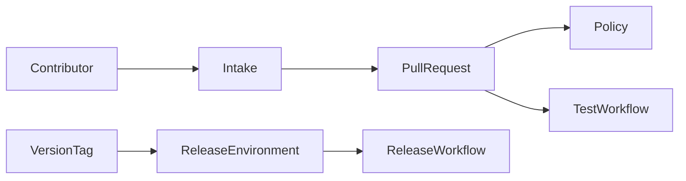
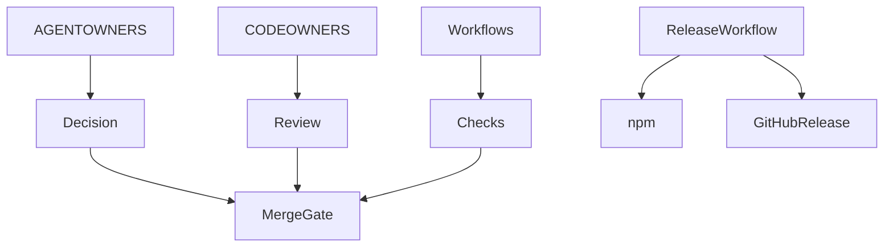
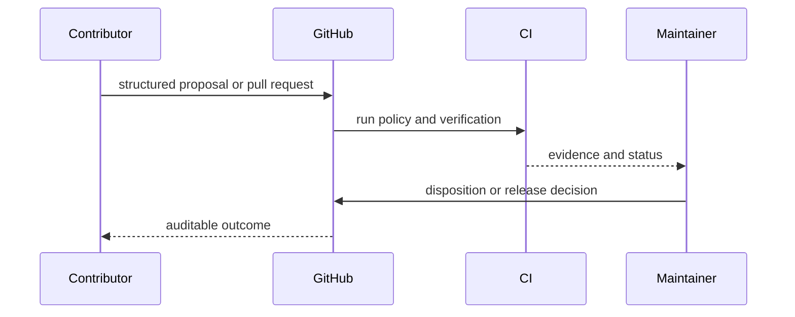

# GitHub Community and Automation

## Overview

This directory contains privileged repository automation, contribution intake,
review ownership, and the repository's own policy. Workflow changes remain
hard-blocked for agents under `.github/AGENTOWNERS.yml`.

## Key Components

- `AGENTOWNERS.yml`: policy applied to this repository
- `CODEOWNERS`: human ownership routing
- `ISSUE_TEMPLATE/`: structured defect and feature intake
- `DISCUSSION_TEMPLATE/`: structured community proposals
- `PULL_REQUEST_TEMPLATE.md`: contribution evidence contract
- `workflows/test.yml`: pull-request and main verification
- `workflows/release.yml`: OIDC package and GitHub Action release pipeline

## Diagrams

## Release constraints

- Release tags must match the repository package version exactly.
- `release.yml` must retain `id-token: write` and must not use an npm write
  token.
- Release builds do not use a package-manager cache.
- Moving Action major tags update only after package and GitHub Release success.

## Verification

Discussion form filenames must match category slugs. Validate YAML structure,
run `pnpm verify`, and never modify workflows when policy self-check blocks it.
