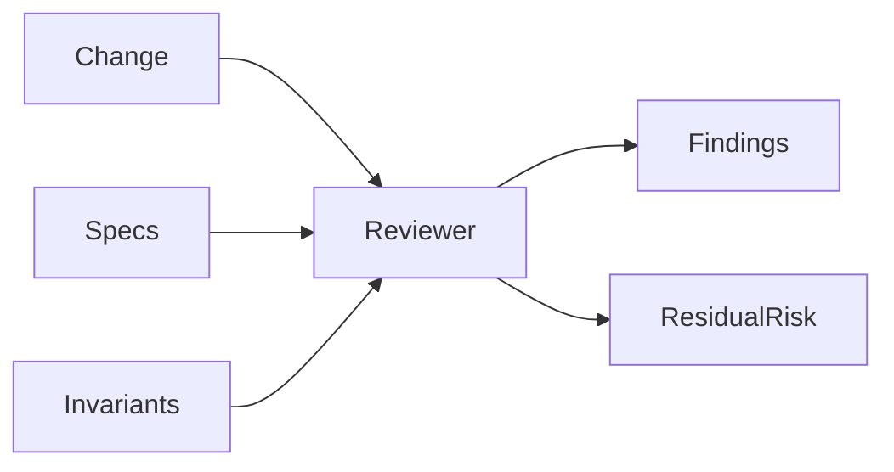
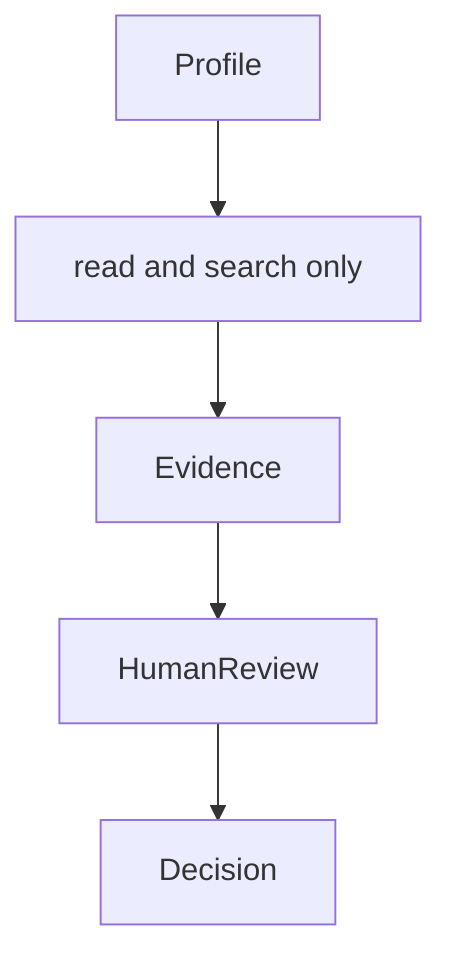
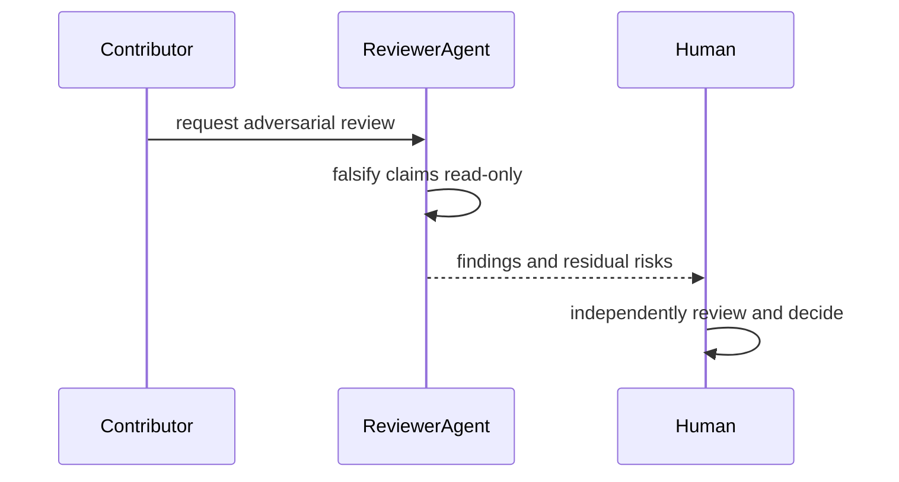

# Repository Custom Agents

## Overview

Custom agents encode narrow contributor workflows. Tool access must be no
broader than the task, and agent output never replaces required human review.

## Key Components

- `policy-engineer.agent.md`: tests-first implementation and policy review
- `adversarial-reviewer.agent.md`: manually invoked, read-only falsification

## Diagrams

## Verification

Validate frontmatter against GitHub's current custom-agent contract. Reviewer
profiles must remain non-editing and must state that their output is not
independent approval.
