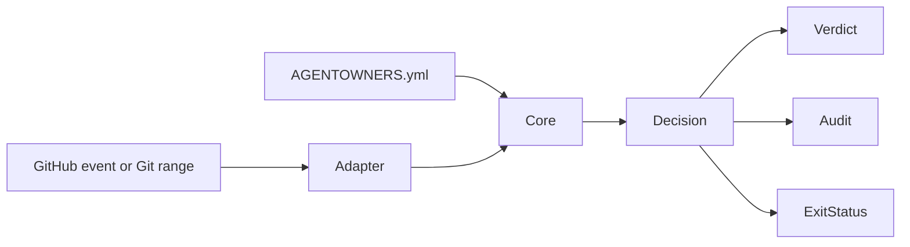
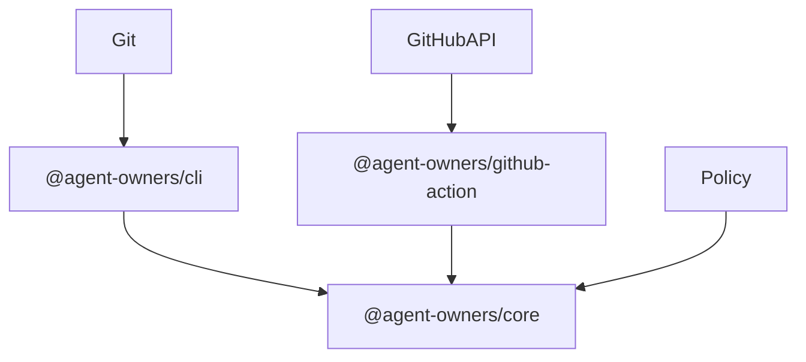
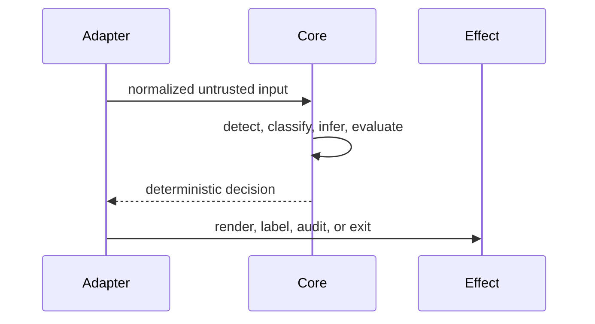

# AGENTS.md — AGENTOWNERS

> This file is the canonical guide for AI agents contributing to AGENTOWNERS.
> It is designed to be machine-readable, unambiguous, and durable across model generations.

## What this project is

AGENTOWNERS is a TypeScript monorepo that ships a governance layer for AI agents in GitHub repositories:

- `@agent-owners/core` — deterministic policy engine (schema, evaluation, detection, scoring, rendering)
- `@agent-owners/cli` — `agentowners` CLI tool  
- `@agent-owners/github-action` — GitHub Action for CI enforcement

## Quickstart for agents

```bash
# 1. Install dependencies
pnpm install

# 2. Build all packages
pnpm build

# 3. Run all tests (must pass before any commit)
pnpm test

# 4. Type check
pnpm typecheck

# Complete gate, including release-artifact smoke tests
pnpm verify
```

## Repository map

```
packages/core/src/
  types.ts       — all TypeScript types (no runtime code, canonical source of truth)
  schema.ts      — Zod schema + parsePolicy() function
  json-schema.ts — deterministic JSON Schema generation from Zod
  loader.ts      — YAML file loading, resolution order, error types
  classifier.ts  — file classification, glob matching, secret detection
  detection.ts   — AI agent detection from actor/commit/body signals
  actions.ts     — action inference from GitHub event types
  evaluator.ts   — event-specific rule evaluation, decision logic, default policy
  scoring.ts     — deterministic risk scoring 0–100
  renderer.ts    — markdown verdict generation, audit JSON
  fixtures.ts    — strict portable fixture parsing and deterministic execution
  profiles.ts    — built-in policy profiles (minimal, strict-oss, security-sensitive)
  index.ts       — barrel export (all public API)

packages/core/tests/
  adversarial-corpus.test.ts — table-driven safety regression corpus
  custom-agents.test.ts — custom-agent frontmatter and privilege contracts
  schema.test.ts     — Zod schema validation
  json-schema.test.ts — generated-schema parity and drift protection
  loader.test.ts     — YAML loading and file resolution
  classifier.test.ts — file classification
  detection.test.ts  — agent detection signals
  actions.test.ts    — action inference
  evaluator.test.ts  — rule evaluation
  scoring.test.ts    — risk scoring
  renderer.test.ts   — verdict rendering
  profiles.test.ts   — built-in profiles parse correctly
  integration.test.ts — end-to-end pipeline with fixtures
  fixtures-runner.test.ts — public fixture schema, runner, and loader contract
  fixtures/           — policies, events, exact outcomes, and corpus guidance

packages/cli/src/
  index.ts           — commander entry point
  git.ts             — shell-free Git adapter (getChangedFiles, getCommitMessages)
  commands/init.ts   — agentowners init
  commands/validate.ts — agentowners validate
  commands/check.ts  — agentowners check
  commands/explain.ts — agentowners explain
  commands/fingerprint.ts — agentowners fingerprint
  commands/self-check.ts — versioned pre-PR machine contract
  commands/test.ts  — portable policy fixture runner

packages/cli/tests/
  self-check.test.ts — output contract, exit codes, and hostile-ref coverage
  test-command.test.ts — fixture diagnostics, JSON output, and exit codes

packages/github-action/src/
  index.ts    — main action entry
  github.ts   — GitHub API helpers (PR files, PR metadata)
  comment.ts  — sticky comment upsert (VERDICT_MARKER)

.github/agents/
  policy-engineer.agent.md — tests-first implementation specialist
  adversarial-reviewer.agent.md — read-only falsification specialist

examples/
  minimal/            — permissive starting point for new projects
  strict-oss/         — strict open-source project policy
  security-sensitive/ — maximum restriction for security-critical repos
  monorepo/           — per-package rules in a monorepo

docs/specs/
  readme.md           — full product specification (canonical requirements)
  f1-policy-schema.md through f11-agent-self-check.md — per-feature specs
  f13-policy-fixtures.md — portable executable policy-suite contract

docs/ecosystem.md     — dated control-surface comparison and product boundaries

.github/DISCUSSION_TEMPLATE/
  ideas.yml           — evidence-first feature proposal intake

scripts/
  generate-json-schema.mjs   — regenerate or check the authoring schema
  verify-release.mjs         — version, export, CLI, and Action bundle checks
  verify-packed-packages.mjs — isolated npm install, audit, and runtime smoke checks

CHANGELOG.md          — release history and security-relevant changes
```

## Architecture diagrams

### Flowchart



### Component diagram



### Sequence diagram



See `docs/architecture.md` for trust boundaries and expanded diagrams.

## Decision to code: key invariants

These are immutable safety rules. Never change them:

| Invariant | Rule |
|-----------|------|
| Decision priority | `block > require_approval > allow` — always, no exceptions |
| Policy as data | Never `eval()`, `new Function()`, or execute policy content as code |
| Strict schema | Unknown fields and empty rule conditions fail validation |
| Secret redaction | Never print matched secret values — use `[REDACTED]` |
| Determinism | Same inputs → same output. No randomness, no timestamps in evaluation |
| No database | The core engine is stateless: policy file + event context → Decision |
| Least privilege | GitHub Action never requests `repo:admin` or `secrets:read` permissions |
| Fail closed | Unknown agent defaults to `require_approval`, never silently `allow` |
| Trusted policy | Pull requests are evaluated against policy from the immutable base commit |
| Git option boundary | Untrusted refs must follow `--end-of-options` |

## How to add a new feature

### 1. Read the spec first
Feature specs are in `docs/specs/f*.md`. The root spec is `docs/specs/readme.md`.

### 2. Follow the implementation order
Per spec section 29 — always in this order:
1. Add types to `packages/core/src/types.ts`
2. Add Zod schema to `packages/core/src/schema.ts`
3. Implement in the relevant module
4. Export from `packages/core/src/index.ts`
5. Write tests BEFORE implementing (TDD)

### 3. Add tests
- Unit test file: `packages/core/tests/<module>.test.ts`
- Integration fixture if the feature changes the evaluation pipeline
- All tests must pass: `pnpm test`

### 4. Export
Add new public exports to `packages/core/src/index.ts`.

## Adding a new policy profile

1. Add the YAML string to `packages/core/src/profiles.ts` in the `PROFILES` record
2. Add example YAML to `examples/<profile-name>/AGENTOWNERS.yml`
3. Add the profile name to the `--profile` option in `packages/cli/src/commands/init.ts`
4. Add a test in `packages/core/tests/profiles.test.ts`

## Testing philosophy

- **TDD**: write the failing test first, then implement
- **Fixtures over mocks**: use `tests/fixtures/` for integration scenarios
- **Deterministic**: tests must not depend on clock, randomness, or network
- **Coverage target**: 80%+ on `@agent-owners/core`

```bash
# Run with coverage
pnpm --filter @agent-owners/core test -- --coverage

# Run a single test file
pnpm --filter @agent-owners/core test -- packages/core/tests/evaluator.test.ts

# Run tests matching a pattern
pnpm --filter @agent-owners/core test -- --reporter verbose -t "block rule"
```

## Git workflow

```bash
# Feature branch
git checkout -b feat/my-feature

# Conventional commit format
git commit -m "feat(core): add X to Y"
git commit -m "fix(cli): handle Z edge case"
git commit -m "test(core): add coverage for W"
git commit -m "docs: update policy reference for V"
```

Before implementation, refresh `origin/main` and inspect open or recently
merged work for the same invariant. If another contribution overlaps, preserve
distinct counterexamples and mutation evidence. Do not replace an external
contribution silently; record the exact overlap and attribution in the PR.

Types: `feat`, `fix`, `refactor`, `test`, `docs`, `chore`, `perf`, `ci`

## TypeScript rules

- `import` paths must end in `.js` (NodeNext module resolution)
- No `any` — use `unknown` and narrow safely
- Export types with `export type`, not `export`
- Keep functions under 50 lines
- Keep files under 800 lines

## Security checklist (run before every commit)

- [ ] No hardcoded secrets or tokens
- [ ] Secret patterns in diff content are detected but never printed
- [ ] No `eval`, `new Function`, or dynamic `require` from policy input
- [ ] No shell execution with user-controlled strings
- [ ] Git subprocesses use argv APIs such as `execFileSync`, never interpolated commands
- [ ] GitHub Action permissions are `contents: read`, `pull-requests: write`, `issues: write` only

## Generated release artifacts

`packages/github-action/dist/index.js` is intentionally committed because
GitHub executes JavaScript Actions directly from the repository. Never edit it
by hand. Run `pnpm build`, then `pnpm verify:release`, and include the regenerated
bundle whenever Action source changes.

`packages/core/agentowners.schema.json` is also generated. Never edit it by
hand. After changing `schema.ts` or `json-schema.ts`, run
`pnpm generate:schema`; `pnpm verify:schema` fails on drift.

## What NOT to build (v1 non-goals)

Do not add these — they are explicitly out of scope for v1:

- A database or persistent state store
- A SaaS API or dashboard
- A new agent protocol or framework
- Auto-merge or `repo:admin` permissions
- Payment or billing logic

These are roadmap items for v2+ (see spec section 27).

## Common agent mistakes to avoid

1. **Import without `.js`** — NodeNext requires `./foo.js` not `./foo`
2. **Mutating `MatchedRule`** — return new objects, never mutate
3. **Changing decision priority** — `block > require_approval > allow` is immutable
4. **Printing secret values** — always redact with `[REDACTED]`
5. **Adding network calls to `@agent-owners/core`** — core is pure/stateless
6. **Skipping barrel export** — always add new exports to `src/index.ts`
7. **Writing Git config in tests** — pass fixture identity through the commit
   subprocess environment; never mutate contributor repository configuration

## Roadmap hooks (design for these, don't build yet)

Future features that current code should not break:

- **v1.1**: GitHub App webhook mode, label application, reviewer request
- **v1.2**: Agent self-check CLI command, SARIF output format
- **v2**: Signed agent manifests, org-level policy inheritance, GitLab support

Keep these in mind when making architectural decisions.
