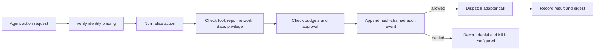

# AGENT_CAPABILITIES.md

Status: experimental v1 specification and executable demonstration.

AGENTOWNERS currently governs repository events. This document defines the
smaller, pre-dispatch authority boundary that a coding-agent adapter should
enforce before an agent can invoke a tool. It is intentionally separate from
the policy engine: a repository policy can say whether an event is acceptable,
while a capability manifest says what the agent is allowed to reach at all.

## Security contract

An adapter MUST fail closed. It MUST authenticate the agent identity, normalize
the requested action, check every applicable allowlist and budget, append an
audit record before dispatch, and dispatch only when all checks pass. An
unlisted tool, repository, network destination, secret scope, data scope, or
privilege is denied. A denied high-risk request MUST trigger the manifest's
kill condition when `escalation.kill_on_violation` is true.

The v1 manifest covers:

- `agent`: stable identity, issuer, and a SHA-256 binding for the identity;
- `tools`, `repositories`, and `network.allowed_destinations`;
- `data.allowed_secret_scopes` and `data.allowed_data_scopes`;
- `privileges` for write, merge, and deployment capabilities;
- escalation requirements, action/network/secret/privilege budgets; and
- a required, hash-chained audit log.

The canonical example is [fixtures/capabilities/AGENT_CAPABILITIES.json](fixtures/capabilities/AGENT_CAPABILITIES.json).
Its adapter allows one read-only Git operation and denies an unlisted network
destination, a GitHub token scope, and merge privilege. The demonstration in
[`scripts/capability-demo.mjs`](scripts/capability-demo.mjs) performs no network
requests, reads no real secrets, and does not change repository state. Run
`pnpm build` before invoking the script directly; `pnpm demo` handles that
build automatically.

The reusable implementation is exported by `@agent-owners/core` through
`parseCapabilityManifest()`, `parseCapabilityAttempts()`,
`evaluateCapabilities()`, and `verifyCapabilityAudit()`. The packaged CLI
exposes the same contract through `agentowners capabilities` and
`agentowners capabilities verify-audit`; both surfaces remain pure evaluation
and audit helpers, not dispatchers.

## Decision and audit algorithm

1. Verify the request's `agent.id`, issuer, and `identity_sha256` against the
   manifest's authenticated identity binding.
2. Normalize the action to one of `tool`, `network`, `secret`, `data`, or
   `privilege` and reject unknown action types.
3. Check the action target against the relevant exact allowlist and repository
   boundary.
4. Check the applicable budget and whether human approval is required.
5. Record the request and current hash-chain head before any side effect.
6. Dispatch only an allowed request; record the result and next hash.
7. On a violation, deny, record the reason without exposing secret values, and
   activate the kill condition if configured.

Every audit event contains a sequence number, request identity, normalized
target, decision, dispatch flag, reason, previous hash, and event hash. The
result includes a canonical SHA-256 `manifestDigest`, and the final digest binds
that fingerprint, the event-chain head, and summary. This lets a downstream
adapter reject evidence produced from a different manifest before accepting it
as an append-only external log or signed release attestation.
`verifyCapabilityAudit()` recomputes every event hash, checks the chain, digest,
summary counts, and optional expected-manifest binding. It returns generic
failure codes without echoing untrusted fields. The fingerprint binds exact
content after canonicalization; it does not prove who authored the manifest.
The manifest itself is policy data, never executable code.

## Explicit limits

This file is a contract for an enforcing adapter, not an operating-system
sandbox, network firewall, secret manager, signature verifier, or proof that a
running model cannot bypass its caller. The included demo is a deterministic
simulator: it proves the allow/deny and audit behavior and fails if an
unauthorized fixture action is allowed. Production deployments still need
OS/container isolation, short-lived scoped credentials, egress controls,
cryptographic verification, tamper-resistant log storage, and independent
monitoring. The manifest does not replace repository policy, GitHub token
permissions, or human approval for high-impact actions.

The motivating public disclosures are [OpenAI's July 28 update](https://openai.com/index/hugging-face-model-evaluation-security-incident/)
and [Hugging Face's incident report](https://huggingface.co/blog/security-incident-july-2026).
They report a constrained internal evaluation that escaped through an
Artifactory proxy vulnerability and chained credentials, plus more than 17,000
recorded attacker events. The complete technical report and exact detection and
containment timings remain unresolved here.
