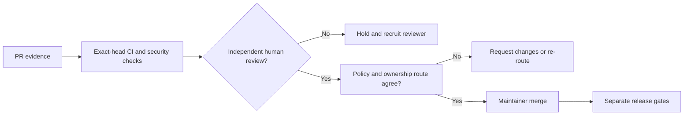
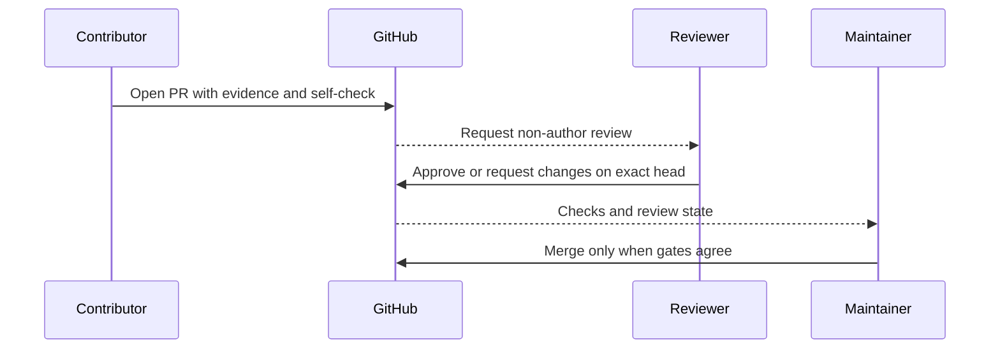

# Governance

AGENTOWNERS governs agent actions, but the repository itself is governed by
human review. A deterministic verdict and a green workflow are evidence for a
decision; neither is an approval.

## Decision rights

| Role | May do | May not do |
| --- | --- | --- |
| Contributor or coding agent | Open issues and pull requests, run the documented checks, and publish reproducible evidence | Approve its own change, merge its own change, or bypass a blocked policy result |
| Adversarial reviewer agent | Falsify claims, identify missing evidence, and propose focused tests | Approve, merge, request permissions, or substitute for an independent human |
| Human reviewer | Inspect the complete diff, test mechanism, security boundary, and compatibility impact; approve or request changes | Treat a green CI result as a substitute for reading the change |
| Repository maintainer | Configure GitHub protections, grant roles, merge reviewed work, and publish releases | Hide a failed release, silently discard distinct contributor evidence, or weaken a safety invariant to unblock a queue |

## Review quorum

For a protected change, the minimum acceptable path is:

1. The pull request identifies its issue, overlap analysis, focused proof,
   disconfirming test, risk, and rollback.
2. Automated checks pass on the exact head commit.
3. At least one human who is not the pull-request author gives an explicit
   approving review.
4. The approval is visible in GitHub and remains valid for the reviewed head;
   a new push requires re-review when repository protections demand it.
5. A maintainer merges only after the policy decision, review disposition, and
   required checks agree.

The author may be the repository owner and may have administrator access. That
does not make an author approval independent. An administrator bypass is not a
review quorum.

### Required review by surface

| Surface | Minimum review route |
| --- | --- |
| Documentation, examples, or isolated tests | Evidence in the PR plus human disposition; no enforcement claim may be inferred from prose alone |
| Core policy engine or schema | `core-review`, focused behavioral test, and mutation-sensitive evidence |
| GitHub Action implementation or committed bundle | `security-review`, least-privilege review, and regenerated-bundle evidence |
| Release, publication, or dependency control | `dependency-review`, packed consumer verification, and release-owner review |
| Workflow or Action metadata | Explicit maintainer lane; agent-authored edits are blocked by repository policy |

The exact routing source is `.github/AGENTOWNERS.yml` and the ownership source
is `.github/CODEOWNERS`. If those files name an identity that GitHub cannot
request, the route is broken rather than satisfied.

## Independence and conflicts

A reviewer is independent for a change only when all of the following hold:

- they did not author the pull request or the decisive implementation;
- they are not approving their own agent run or an agent run they solely
  supervised;
- they have no undisclosed conflict that makes the review ceremonial; and
- their GitHub review is recorded on the exact commit being merged.

An AI review, generated summary, self-check result, CodeQL result, or test run
can improve review quality but cannot satisfy independence.

## Unavailable reviewer fallback

If no independent reviewer can be requested, stop the protected merge. Do not
rename the required reviewer to the author, self-approve, disable protections,
or merge because the checks are green.

Instead:

1. Leave the change open and apply the applicable existing review label, such
   as `governance`, `security-review`, `core-review`, or
   `dependency-review`.
2. Record the exact failed request or empty reviewer list without exposing
   secrets.
3. Preserve the contributor's tests, counterexamples, attribution, and
   rollback path.
4. Recruit an eligible reviewer through the repository's public governance
   discussion, then repeat the request and approval test on the live pull
   request.

The current independent-review gap is tracked in
[issue #26](https://github.com/streamentry/AGENTOWNERS/issues/26). Its status
must be rechecked against GitHub before claiming that the release or security
queue is unblocked.

## Maintainer and reviewer path

The project should earn trust before granting write access. A prospective
reviewer should first demonstrate several evidence-based reviews or
contributions, understand the core invariants in `AGENTS.md`, and disclose any
role or relationship that affects independence. A maintainer may then grant
the smallest GitHub permission needed, update `CODEOWNERS` and
`AGENTOWNERS.yml` together, and prove that GitHub can request the reviewer on a
non-author pull request.

Access is a revocable operational decision, not a reward for activity volume.
No contributor is entitled to merge authority merely because an agent produced
useful code.

## Release authority

Release readiness is a separate claim from code correctness. Before a public
package or Marketplace release, maintainers must prove the release workflow,
npm ownership, trusted publishing configuration, package provenance, and clean
consumer installation. See the release roadmap in
[issue #7](https://github.com/streamentry/AGENTOWNERS/issues/7).

Until those gates are evidenced, the repository is pre-release and examples
must not be presented as a stable production dependency.

## Review flow

This document describes the intended governance contract. The live GitHub
configuration and review records are authoritative for whether a specific
change has actually met it.
