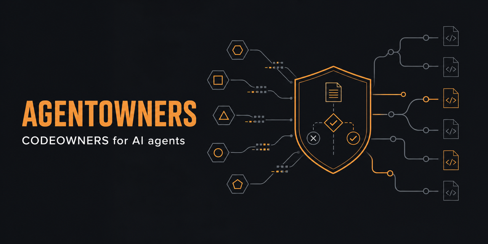

# AGENTOWNERS

[](https://github.com/streamentry/AGENTOWNERS/actions/workflows/test.yml)
[](LICENSE)
[](package.json)



**CODEOWNERS for AI agents.**

`AGENTS.md` tells agents how to work. `AGENTOWNERS.yml` defines what they are
allowed to do. One is guidance. The other is an enforceable, deterministic
repository policy.

> **Pre-release:** the engine, CLI, and Action are under active hardening.
> The npm packages and stable `v0` Action tag are not published yet. Evaluate
> from source; do not pin a production workflow to `main`.

---

## Why

AI agents can now open PRs, comment on issues, review code, and trigger automation in your repository. The missing layer is not another AI reviewer. It is **repo-native governance**:

- Which agent is acting?
- What action is it trying to perform?
- Is the action allowed by policy?
- Does it require human approval?
- Who should review it?
- Was the decision auditable?

AGENTOWNERS answers all of these from a single YAML file checked into the
repository. It uses no model, hosted service, database, or external policy API.
The same inputs produce the same decision.

See [Where AGENTOWNERS fits](docs/ecosystem.md) for a dated comparison with
instructions, custom agents, Copilot hooks, GitHub rulesets, general policy
engines, and native audit records. The comparison states when to choose
AGENTOWNERS, when to choose another control, and what this project does not
claim.

---

## What ships

| Package                       | Responsibility                                                          | Trust boundary                                            |
| ----------------------------- | ----------------------------------------------------------------------- | --------------------------------------------------------- |
| `@agent-owners/core`          | Schema, detection, classification, evaluation, scoring, rendering       | Pure and stateless; no shell, network, clock, or database |
| `@agent-owners/cli`           | Local policy creation, validation, fingerprinting, and Git-range checks | Git refs are passed as argv, never through a shell        |
| `@agent-owners/github-action` | Event ingestion, sticky verdicts, labels, audit output, CI status       | Least-privilege GitHub token permissions                  |

The engine detects agent signals, classifies changed paths, infers actions,
applies agent-specific and repository-wide rules, and resolves conflicts with
one immutable precedence rule:

```text
block > require_approval > allow
```

Unknown agents require approval by default. Workflow and secret-file changes
block by default.

---

## Evaluate it now

Until the first signed release, run the repository directly:

```bash
git clone https://github.com/streamentry/AGENTOWNERS.git
cd AGENTOWNERS
corepack enable
pnpm install --frozen-lockfile
pnpm build

node packages/cli/dist/index.js init --profile strict-oss
node packages/cli/dist/index.js validate .github/AGENTOWNERS.yml
node packages/cli/dist/index.js check --base main --head HEAD --mode enforcement
```

Run `pnpm verify` to execute lint, type checking, all tests, builds, and release
artifact smoke tests.

## Configure a policy

Add `.github/AGENTOWNERS.yml`:

```yaml
# yaml-language-server: $schema=https://raw.githubusercontent.com/streamentry/AGENTOWNERS/main/packages/core/agentowners.schema.json

version: 1

defaults:
  known_agent: require_approval
  unknown_agent: require_approval
  docs_only: allow
  workflows: block
  secrets: block

rules:
  - name: 'Allow docs-only changes'
    when:
      docs_only: true
    effect: allow
    reason: 'Docs-only changes are low risk.'

  - name: 'Block workflow edits'
    when:
      files:
        - '.github/workflows/**'
    effect: block
    reason: 'Agents may not modify GitHub Actions workflows.'

  - name: 'Require approval for dependency changes'
    when:
      changes_package_files: true
    effect: require_approval
    reason: 'Dependency changes require maintainer review.'
```

The first-line schema directive gives compatible YAML editors completion and
validation against the same Zod contract used at runtime. The generated
[JSON Schema](packages/core/agentowners.schema.json) rejects unknown fields,
empty `match` and `when` objects, and actions assigned to conflicting policy
lists.

After a stable `v0` release exists, add the GitHub Action. Pin the immutable
release commit SHA in high-trust repositories; the major tag below is the
convenience form:

```yaml
name: AGENTOWNERS

on:
  pull_request:
    types: [opened, synchronize, reopened, ready_for_review]
  issues:
    types: [opened, labeled, closed]
  issue_comment:
    types: [created]
  pull_request_review:
    types: [submitted]

permissions:
  contents: read
  pull-requests: write
  issues: write

jobs:
  agentowners:
    runs-on: ubuntu-latest
    steps:
      - uses: actions/checkout@v7
      - uses: streamentry/AGENTOWNERS@v0
        with:
          policy-path: '.github/AGENTOWNERS.yml'
          mode: 'both'
          fail-on-block: 'true'
```

Open an agent-generated PR and inspect the verdict before switching from
observation to enforcement.

---

## Example verdict

When a PR opens from `github-copilot[bot]` modifying `src/auth/session.ts`:

```markdown
## AGENTOWNERS verdict: requires approval

This PR appears to be created by `github-copilot[bot]`.

Risk level: high
Risk score: 65/100

Matched rules:

1. `Require approval for auth changes`
   - matched files: `src/auth/session.ts`
   - reason: Auth and permission changes require human review.

Required reviewers:

- @maintainers/security

Suggested labels:

- ai-agent
- needs-human-review
- risk-high
```

---

## CLI

```bash
# Available after the first npm release:
npm install -g @agent-owners/cli

# Create a policy file
agentowners init --profile minimal

# Validate a policy file
agentowners validate .github/AGENTOWNERS.yml

# Check local diff against policy
agentowners check --base main --head HEAD

# Produce deterministic SARIF 2.1.0 for code-scanning upload
agentowners check --base main --head HEAD --output sarif > agentowners.sarif

# Give an agent a versioned pre-PR decision contract
agentowners self-check \
  --policy .github/AGENTOWNERS.yml \
  --base origin/main \
  --head HEAD \
  --actor coding-agent[bot]

# Execute portable policy expectations
agentowners test \
  --policy .github/AGENTOWNERS.yml \
  --fixtures .agentowners/fixtures.yml

# Detect agent signals in current commit
agentowners fingerprint --commit HEAD
```

`self-check` always uses explicit policy, refs, and actor inputs. It returns
stable JSON with the decision, risk, matched rules, blocked actions, reviewers,
and a bounded next action. It makes no model or GitHub API calls and never
modifies the repository.

`test` executes a strict, versioned fixture suite through the same detection,
classification, action-inference, and evaluation pipeline used in production.
It rejects unsafe paths and unknown fields, reports every failed assertion,
and returns nonzero when expectations drift.

`check --output sarif` emits no alert for an allowed decision, warnings for
required approval, and errors for blocked changes. Rule identifiers, partial
fingerprints, and repository-relative locations are stable across equivalent
runs. Upload the file with `github/codeql-action/upload-sarif@v4` where GitHub
code scanning is available.

---

## Policy profiles

| Profile              | Default behavior    | Use case                           |
| -------------------- | ------------------- | ---------------------------------- |
| `minimal`            | `require_approval`  | New projects, getting started      |
| `strict-oss`         | `require_approval`  | Open-source with many contributors |
| `security-sensitive` | `block` for unknown | Security-critical repositories     |
| `monorepo`           | Per-package rules   | Large monorepos                    |
| `dependency-bots`    | Bot-specific gates  | Dependabot or Renovate             |

```bash
agentowners init --profile strict-oss
agentowners init --profile security-sensitive
agentowners init --profile monorepo
agentowners init --profile dependency-bots
```

Each profile is generated by the CLI and has a matching
[`examples/`](examples/) policy for review and customization. The
`dependency-bots` profile requires human approval for dependency updates while
blocking workflow, authentication, permission, and secret-file changes.

---

## Policy format

### Root structure

```yaml
version: 1

agents:
  github-copilot:
    match:
      actors:
        - 'github-copilot[bot]'
    allowed:
      - open_pr
      - comment
    requires_approval:
      - modify_tests
    blocked:
      - merge_pr
      - edit_workflows

defaults:
  unknown_agent: require_approval
  known_agent: require_approval
  docs_only: allow
  workflows: block
  secrets: block

rules:
  - name: 'Block workflow edits'
    when:
      files:
        - '.github/workflows/**'
    effect: block
    reason: 'Agents may not modify CI/CD workflows.'
```

### Rule conditions

| Condition | Type | Description |
|-----------|------|-------------|
| `files` | `string[]` | Glob patterns for changed files |
| `files_not` | `string[]` | Exclude if any file matches |
| `agents` | `string[]` | Agent names from policy |
| `actors` | `string[]` | GitHub actor usernames |
| `actions` | `AgentAction[]` | Inferred actions |
| `labels` | `string[]` | PR/issue labels |
| `pr_title` | `string[]` | PR title substring or regular expression |
| `pr_body` | `string[]` | PR body substring or regular expression |
| `issue_title` | `string[]` | Issue title substring or regular expression |
| `issue_body` | `string[]` | Issue body substring or regular expression |
| `docs_only` | `boolean` | All changed files are docs |
| `tests_only` | `boolean` | All changed files are tests |
| `changes_package_files` | `boolean` | Any dependency file changed |
| `changes_workflows` | `boolean` | Any workflow file changed |
| `changes_auth` | `boolean` | Any auth/security path changed |
| `changes_infra` | `boolean` | Any infra path changed |
| `diff_lines_over` | `number` | Diff exceeds N lines |

### Effects

| Effect             | Meaning                            |
| ------------------ | ---------------------------------- |
| `allow`            | No approval needed                 |
| `require_approval` | Human review required before merge |
| `block`            | Action is forbidden                |

Priority: `block > require_approval > allow`

---

## Detected actions

AGENTOWNERS infers these actions from GitHub events and changed files:

`open_pr` `update_pr` `comment` `review_comment` `approve_pr` `request_changes`
`label_issue` `close_issue` `reopen_issue` `assign_issue` `edit_workflows`
`modify_tests` `modify_docs` `modify_dependencies` `modify_auth` `modify_infra`
`touch_secrets` `change_permissions` `merge_pr`

---

## Agent detection

AGENTOWNERS detects AI agents from:

1. **Policy config:** explicit actor → agent mapping (`confirmed`)
2. **Known bots:** `github-copilot[bot]`, `copilot-swe-agent[bot]`, `dependabot[bot]`, `renovate[bot]` (`confirmed`)
3. **Commit signatures:** `Co-Authored-By: Claude`, `Generated with`, `🤖`, `Claude Code` (`likely`)
4. **PR body markers:** tool-specific footers (`likely`)
5. **Labels:** `ai-generated`, `agent`, `claude`, `copilot` (`possible`)

---

## Risk scoring

Each decision gets a risk score from 0–100:

| Signal                   | Score |
| ------------------------ | ----- |
| Docs only                | +5    |
| Small diff (< 50 lines)  | +5    |
| Tests changed            | +10   |
| Large diff (> 300 lines) | +30   |
| Dependency files changed | +30   |
| Infra paths changed      | +40   |
| Auth paths changed       | +50   |
| Workflow files changed   | +50   |
| Permission changes       | +60   |
| Secret patterns detected | +80   |
| Block action detected    | +100  |

Risk levels: `low` (0–20) · `medium` (21–49) · `high` (50–79) · `critical` (80+)

---

## Enforcement modes

The CLI and Action expose different adapters around the same decision:

| Surface | Mode          | Behavior                                              |
| ------- | ------------- | ----------------------------------------------------- |
| CLI     | `advisory`    | Print verdict; never fail for a blocked decision      |
| CLI     | `enforcement` | Exit nonzero for a blocked decision                   |
| CLI     | `dry-run`     | Print the deterministic decision without side effects |
| Action  | `comment`     | Upsert a verdict comment                              |
| Action  | `check`       | Set outputs and enforce configured failure behavior   |
| Action  | `both`        | Comment and enforce                                   |
| Action  | `dry-run`     | Set outputs without comments or labels                |

The CLI defaults to `advisory`; the Action defaults to `comment`.

---

## Why this is deliberately narrow

AGENTOWNERS governs contributions at the repository boundary. Runtime agent
control planes govern model calls, tools, networks, or data access. They are
complements, not substitutes.

| Question                                              | AGENTOWNERS | Runtime guardrail | AI reviewer |
| ----------------------------------------------------- | ----------- | ----------------- | ----------- |
| May this agent change this repository surface?        | Yes         | Usually not       | No          |
| Is the decision deterministic and reviewable as code? | Yes         | Varies            | No          |
| Does it inspect code quality or correctness?          | No          | No                | Yes         |
| Does it intercept tool calls outside GitHub?          | No          | Yes               | No          |
| Does it require a hosted control plane?               | No          | Often             | Often       |

This boundary is the product. Expanding into model hosting, code review, or a
dashboard would weaken portability and auditability.

---

## Philosophy

This is not an AI reviewer.  
This is a permission layer for AI contributions.

AGENTOWNERS is deterministic: the same policy and PR produce the same verdict. No LLM, external API, or ambiguity.

Design principles:

1. Policy over prompts
2. Constraints over suggestions
3. Deterministic first, AI optional later
4. Maintainer control over agent autonomy
5. Repo-native over SaaS
6. Small config over dashboard
7. Fail safely on sensitive actions
8. Audit every decision
9. Complement `AGENTS.md`, do not replace it
10. First install useful in under five minutes

---

## Contributing

The repository is designed for both human and agent contributors:

- [CONTRIBUTING.md](CONTRIBUTING.md) defines the evidence and PR contract.
- [Good first issues](https://github.com/streamentry/AGENTOWNERS/issues?q=is%3Aopen+label%3A%22good+first+issue%22)
  provide bounded entry work that does not change enforcement semantics.
- [Help wanted](https://github.com/streamentry/AGENTOWNERS/issues?q=is%3Aopen+label%3A%22help+wanted%22)
  identifies deeper work with explicit acceptance criteria.
- [AGENTS.md](AGENTS.md) maps the codebase and immutable invariants.
- [SKILL.md](SKILL.md) gives compatible agents a compact execution workflow.
- [Architecture](docs/architecture.md) documents components and trust boundaries.
- [Ecosystem boundaries](docs/ecosystem.md) distinguishes guidance, runtime
  controls, repository governance, and audit evidence.
- [Roadmap](docs/roadmap.md) names what is next and what will remain out of scope.

High-value contributions are adversarial fixtures, policy ambiguity reports,
cross-platform Git edge cases, and small integrations backed by a failing test.
Overlapping work receives an evidence-based disposition; distinct tests are
not discarded merely because another implementation landed first.

---

## Status

**Pre-release and experimental.** The repository has a working engine and
adapters, but there is no stable npm or Action release yet. Start in advisory
or comment-only mode after a release, inspect false positives, then enable
enforcement.

---

## License

[Apache-2.0](LICENSE). Patent clarity matters for governance-adjacent tooling.
