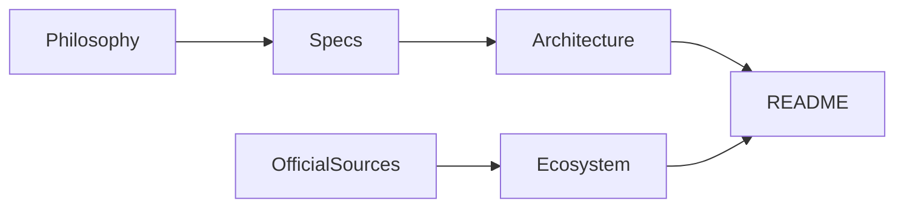
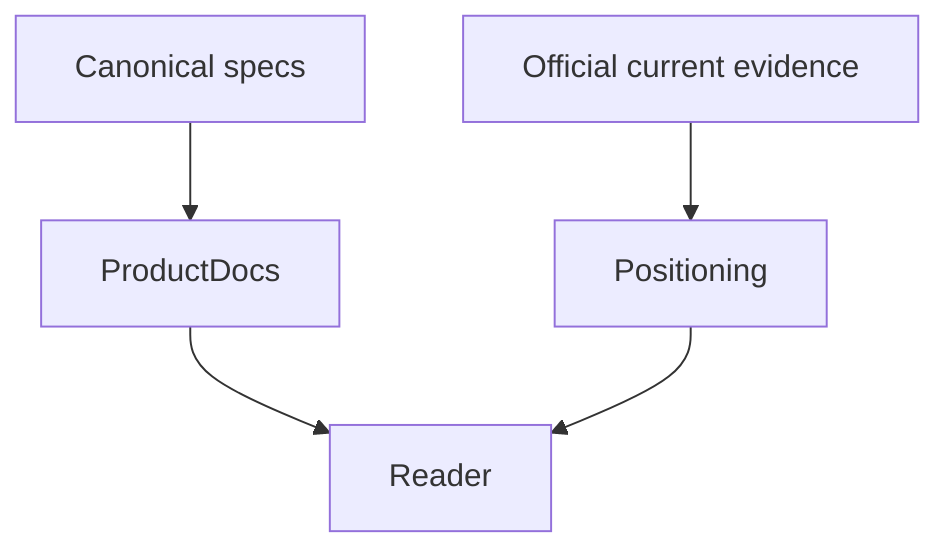
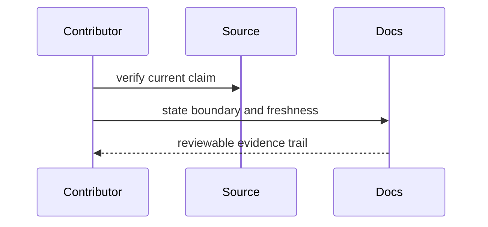

# Documentation

## Overview

Documentation states the product contract, trust boundaries, and verified
positioning. Time-sensitive ecosystem claims require dated official sources.

## Key Components

- `specs/`: canonical product and feature requirements
- `architecture.md`: component and trust-boundary design
- `ecosystem.md`: source-backed control-surface comparison
- `philosophy.md`: durable design principles
- `roadmap.md`: explicit future scope

## Diagrams

## Verification

Run `pnpm verify`, check every external link against its primary source, and
separate current product facts from roadmap claims.
