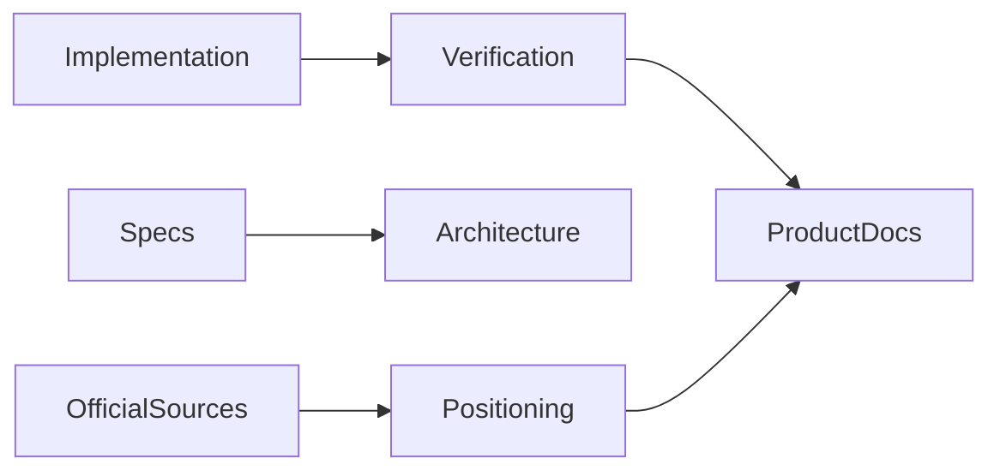
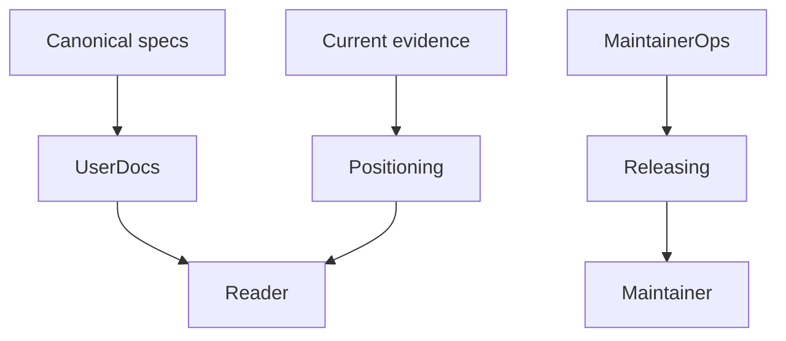
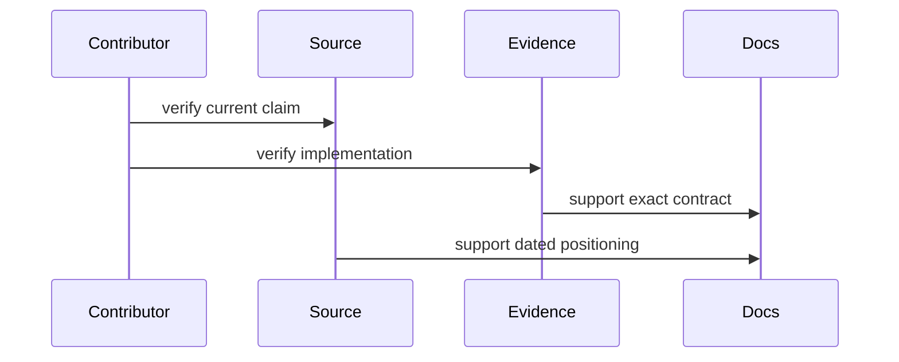

# Documentation

## Overview

Documentation defines product contracts, trust boundaries, positioning,
roadmaps, and maintainer operations. Claims about implemented or
time-sensitive behavior require current evidence.

## Key Components

- `specs/`: canonical product and feature requirements
- `architecture.md`: component and trust-boundary design
- `ecosystem.md`: dated, source-backed control-surface comparison
- `philosophy.md`: durable design principles
- `roadmap.md`: ordered product direction
- `releasing.md`: npm and GitHub Action release contract

## Diagrams

## Documentation constraints

- Mark unavailable releases and integrations as unavailable.
- Keep commands executable and version claims synchronized with manifests.
- Distinguish local verification from public registry or runtime proof.
- Check external claims against primary sources and state their freshness.
