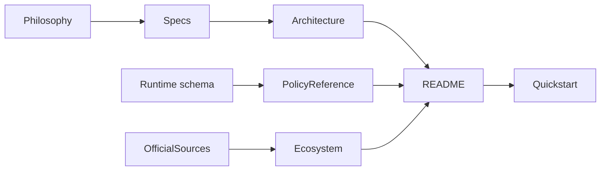
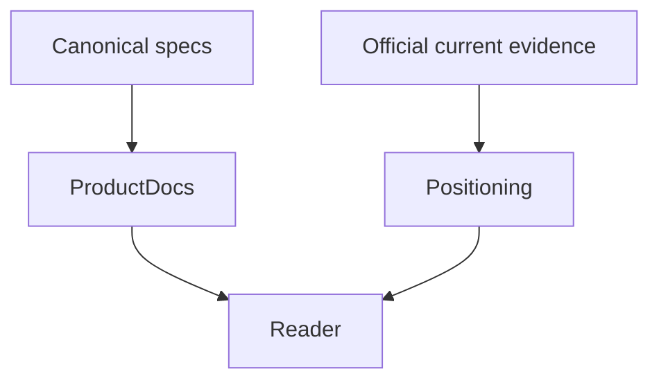
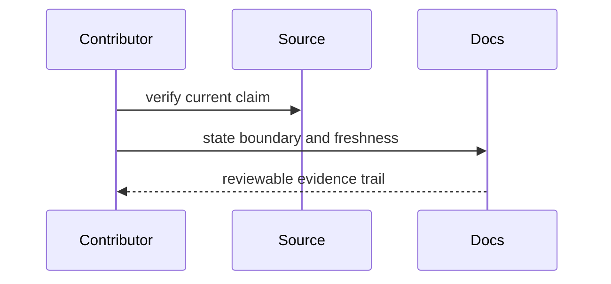

# Documentation

## Overview

Documentation states the product contract, trust boundaries, and verified
positioning. Time-sensitive ecosystem claims require dated official sources.

## Key Components

- `specs/`: canonical product and feature requirements
- `architecture.md`: component and trust-boundary design
- `ecosystem.md`: source-backed control-surface comparison
- `policy-reference.md`: end-user schema, condition, action, and trust contract
- `quickstart.md`: five-minute source checkout and first-decision path
- `philosophy.md`: durable design principles
- `roadmap.md`: explicit future scope
- `releasing.md`: maintainer-only release gates and publication evidence
- `assets/`: maintained documentation and social-preview media

The evaluator specification must state that action-scoped allow rules cannot
drop unlisted detected actions, while block and approval rules may match any
listed action.

## Diagrams

## Verification

Run `pnpm verify` to catch broken local Markdown targets, check every external
link against its primary source, and separate current product facts from
roadmap claims. `pnpm verify:docs` is the focused network-free documentation
gate when only prose or links change.
