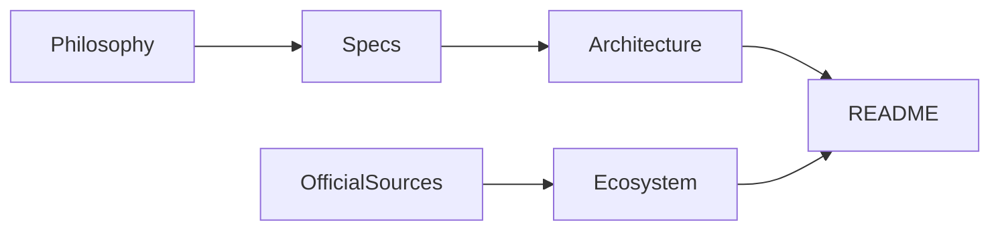
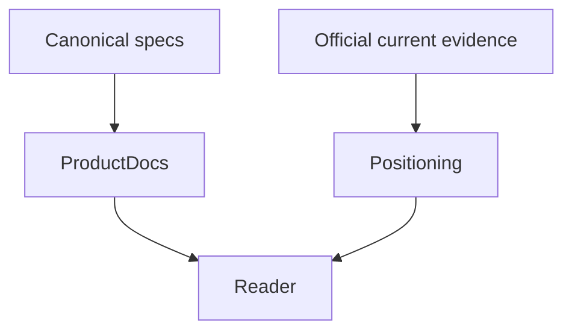
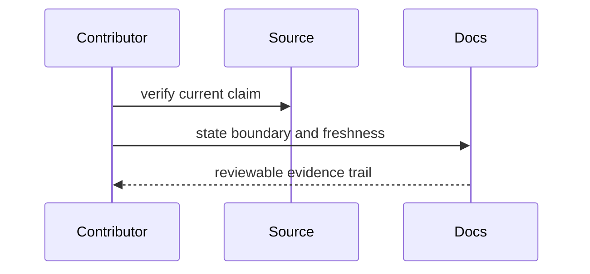

# Documentation

## Overview

Documentation states the product contract, trust boundaries, and verified
positioning. Time-sensitive ecosystem claims require dated official sources.

## Key Components

- `specs/`: canonical product and feature requirements
- `specs/f14-policy-diff.md`: value-free deterministic policy-change evidence
- `specs/f7-verdict-renderer.md` and `specs/f9-github-action.md`: policy-bound
  audit evidence and Action outputs
- `specs/f15-policy-bound-audit.md`: versioned policy provenance contract
- `specs/f16-action-mode.md`: fail-closed Action mode input contract
- `architecture.md`: component and trust-boundary design
- `ecosystem.md`: source-backed control-surface comparison
- `philosophy.md`: durable design principles
- `roadmap.md`: explicit future scope
- `releasing.md`: npm, GitHub Action, and Marketplace release contract
- `assets/`: maintained documentation and social-preview media

## Diagrams

## Verification

Run `pnpm verify`, check every external link against its primary source, and
separate current product facts from roadmap claims. Distinguish offline
Marketplace metadata checks from owner agreement, category, 2FA, and
publication proof.
