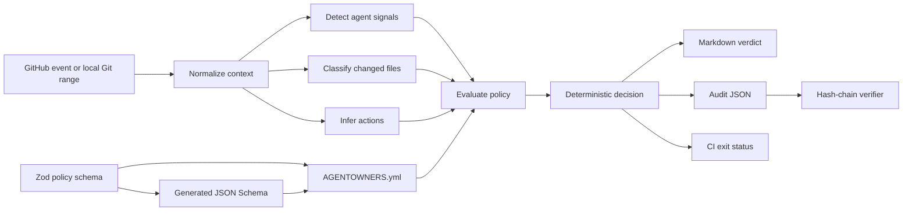
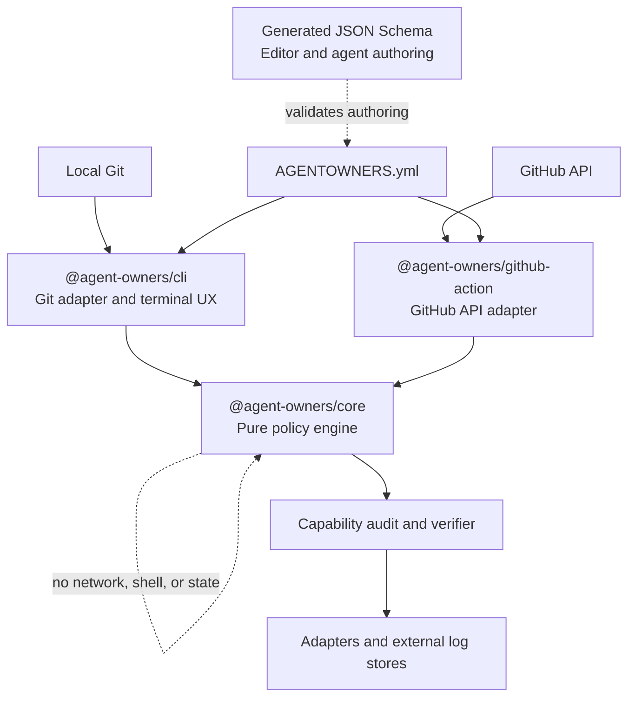
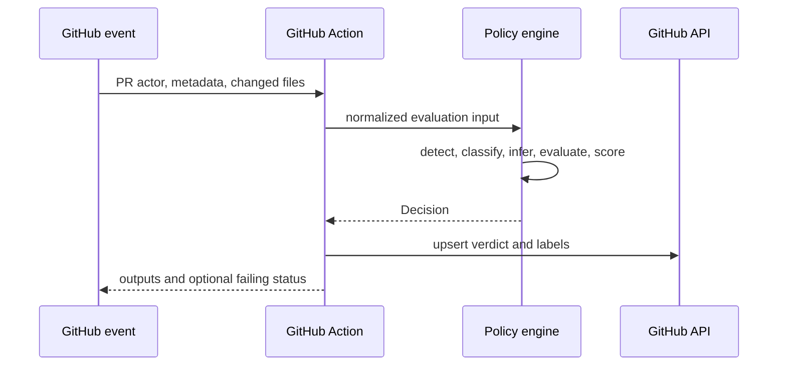

# Architecture

AGENTOWNERS separates pure policy decisions from environment-specific input and
effects. The core never calls GitHub, Git, a network, or a database.

## Flowchart

## Component diagram

## Sequence diagram

Capability adapters may persist the pure audit result and call the verifier
before accepting it as evidence. Verification does not dispatch tools or
provide storage; it only proves the result's schema, chain, digest, and summary
are internally consistent.

## Trust boundaries

- Policy YAML, Git refs, event bodies, labels, and filenames are untrusted.
- The CLI passes Git refs as subprocess arguments without shell interpretation.
- The action requests only repository read plus PR and issue write permissions.
- The core returns data. Adapters own I/O and side effects.
- Conflicting rules resolve deterministically: `block > require_approval > allow`.
