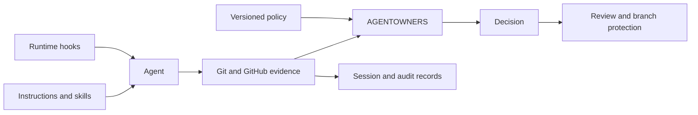

# Where AGENTOWNERS fits

AI repository controls now span several layers. Treating them as substitutes
creates gaps. Instructions can be ignored. Tool hooks do not govern every
agent. Audit records do not decide whether a pull request should merge.

This comparison was verified against official product documentation on
2026-07-28.

## Control-surface matrix

| Surface | Primary job | Decision time | Scope | Deterministic enforcement | Principal boundary |
|---------|-------------|---------------|-------|---------------------------|--------------------|
| `AGENTS.md` and repository instructions | Tell an agent how to work | Before and during a session | Agents that load the file | No | Natural-language guidance is not a repository permission check |
| Custom agent profiles and skills | Specialize prompts, tools, and context | Session creation and execution | Supporting agent runtimes | Partly | Runtime-specific configuration does not govern other agents |
| Copilot hooks | Approve, deny, or observe Copilot tool use | Before or after a tool call | Copilot CLI and Copilot cloud agent | Yes, for configured hooks | Does not cover non-Copilot execution or repository acceptance |
| GitHub branch protection and CODEOWNERS | Gate merge and request human ownership | Pull request review and merge | GitHub repository | Yes | Does not classify agent actions or express agent-specific policy |
| GitHub agent session and audit data | Attribute and investigate agent activity | During and after a session | Supported GitHub plans and surfaces | No decision by itself | Some agent audit fields require enterprise access |
| AGENTOWNERS | Evaluate observed repository actions against versioned policy | Pull request, issue, review, and local preflight | Any agent that leaves supported Git or GitHub evidence | Yes | Does not control an agent's tools or prove identity cryptographically |

## The defensible boundary

AGENTOWNERS is an agent-neutral repository acceptance layer. It evaluates
evidence after an agent acts but before maintainers accept the result:

This boundary is intentionally narrower than a sandbox or enterprise agent
control plane. It is also broader than a vendor-specific hook because the
decision does not depend on which model or agent runtime produced the evidence.

## What AGENTOWNERS does not claim

- It does not prevent an agent from invoking a local tool before a commit.
- It does not replace least-privilege credentials, sandboxing, branch
  protection, CODEOWNERS, secret scanning, or code scanning.
- Heuristic signals are not cryptographic proof of agent identity.
- A green policy check is not proof that a change is correct or secure.
- The GitHub Action can enforce merge policy only when repository rules require
  its check.
- The project is pre-release until public packages and a stable Action tag
  exist.

## Recommended composition

1. Use `AGENTS.md`, instructions, skills, and custom agents to shape behavior.
2. Use runtime hooks and least-privilege credentials to constrain execution
   where the agent supports them.
3. Use AGENTOWNERS to evaluate repository-visible actions consistently across
   agents.
4. Use CODEOWNERS, independent review, and branch protection to enforce the
   resulting approval boundary.
5. Retain native session and audit evidence for investigation.

No one layer is sufficient.

## Official references

- [GitHub: repository custom instructions and `AGENTS.md`](https://docs.github.com/en/copilot/how-tos/configure-custom-instructions-in-your-ide/add-repository-instructions-in-your-ide)
- [GitHub: Copilot hooks](https://docs.github.com/en/copilot/concepts/agents/hooks)
- [GitHub: customization feature comparison](https://docs.github.com/en/copilot/reference/customization-cheat-sheet)
- [GitHub: third-party coding agents](https://docs.github.com/en/copilot/concepts/agents/about-third-party-coding-agents)
- [GitHub: agentic audit-log fields](https://docs.github.com/en/copilot/reference/agentic-audit-log-events)
- [GitHub: Copilot agent risks and mitigations](https://docs.github.com/en/enterprise-cloud@latest/copilot/concepts/agents/cloud-agent/risks-and-mitigations)
- [OpenAI: how OpenAI uses Codex and `AGENTS.md`](https://cdn.openai.com/pdf/6a2631dc-783e-479b-b1a4-af0cfbd38630/how-openai-uses-codex.pdf)
