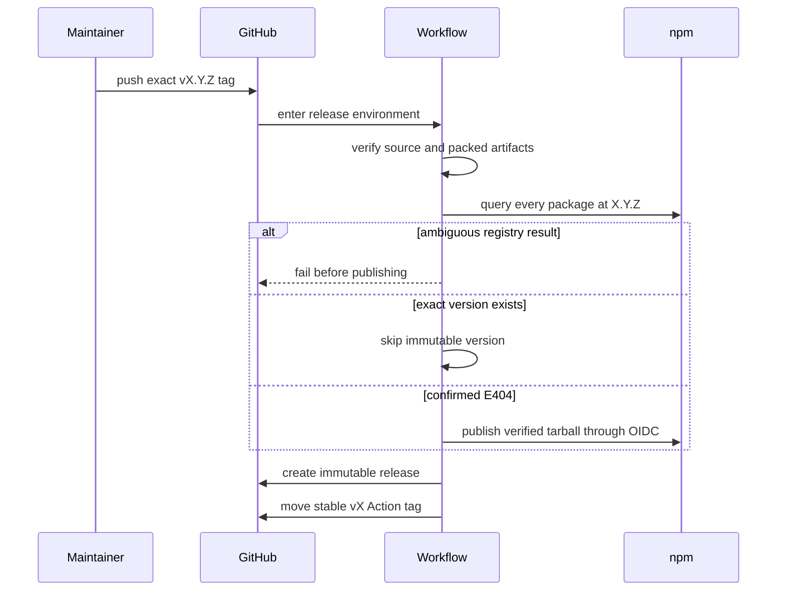

# Release runbook

AGENTOWNERS publishes three npm packages and one repository-native GitHub
Action from the same versioned commit. A release is complete only when the npm
artifacts, GitHub Release, immutable semantic-version tag, and moving stable
major tag are all independently verifiable and the Action listing is public in
GitHub Marketplace.

## Integration status

The tested release entry points in `scripts/` are ready, but the current
`release.yml` workflow does not invoke them. Repository policy hard-blocks
agent-authored workflow changes. A human maintainer must make and review the
workflow integration before pushing the first release tag:

1. narrow the tag trigger so moving major tags do not start releases;
2. disable package-manager caching for the release job;
3. replace the three unconditional publish commands with
   `node scripts/publish-packages.mjs`;
4. after GitHub Release creation, run `node scripts/update-major-tag.mjs`.

Until those four changes are live on `main`, the release workflow is not
idempotent and no release tag should be pushed.

## Target trust model

The integrated `release.yml` workflow runs only for semantic-version-shaped tags. It uses
the GitHub `release` environment and npm trusted publishing, with
`id-token: write` and no long-lived npm write token.

Before any registry mutation, the workflow:

1. runs the full repository and packed-package verification gates;
2. requires npm 11.5.1 or newer;
3. queries every exact package version;
4. aborts on authentication, network, server, or malformed-response errors.

A confirmed npm `E404` is the only result treated as an unpublished version.
Already published exact versions are skipped. Missing packages are packed with
pnpm so `workspace:*` dependencies become release versions, then the resulting
tarballs are published with the OIDC-capable npm CLI.

Stable releases move the compatible major Action tag, such as `v0`, only after
package publication and GitHub Release creation succeed. Prereleases never move
the major tag.



## Marketplace readiness

`pnpm verify:release` parses the root and packaged Action metadata before any
release. It requires:

1. exactly one readable `action.yml` or `action.yaml` at the repository root;
2. non-empty listing name, description, author, icon, and color;
3. the Node 24 runtime and the correct bundle path for each distribution;
4. root and npm-package metadata parity except for their distribution-specific
   `author` and `runs.main` values;
5. a readable committed Action bundle.

These checks prove repository metadata consistency. They do not prove the
owner-only requirements documented by
[GitHub Marketplace publication](https://docs.github.com/en/actions/how-tos/create-and-publish-actions/publish-in-github-marketplace):

- the Marketplace action name is still unique at publication time;
- the repository owner has accepted the Marketplace Developer Agreement;
- primary and optional secondary categories are selected;
- the publishing account completes the required 2FA confirmation;
- the release is actually published with “Publish this Action to the GitHub
  Marketplace” selected.

Do not publish the Marketplace draft until all npm packages, the immutable
release tag, the GitHub Release, and the stable major tag are independently
verified. An offline metadata pass or saved draft is not publication proof.

## One-time npm bootstrap

npm trusted publishing cannot establish ownership of a package that has never
been published. An npm maintainer must perform this once for each package:

1. Check out a clean, current `main`.
2. Run `pnpm install --frozen-lockfile`, `pnpm verify`, and
   `pnpm verify:packages`.
3. Publish `@agent-owners/core`, `@agent-owners/cli`, and
   `@agent-owners/github-action` at the repository version using an npm account
   authorized for the `@agent-owners` scope.
4. Configure each package's trusted GitHub publisher:
   `streamentry/AGENTOWNERS`, workflow `release.yml`, environment `release`,
   permission `npm publish`.
5. Disallow traditional write tokens after the trusted publishers are proven.
6. Confirm each package's repository, license, version, and provenance on npm.
7. Confirm `pnpm verify:release` passes against the exact release commit.

Do not push the public release tag until the workflow integration, all three
ownership records, and trusted publishers exist. Track the one-time work in
[issue #7](https://github.com/streamentry/AGENTOWNERS/issues/7).

## Normal release

1. Update the root and all package versions to the same semantic version.
2. Move `CHANGELOG.md` entries from Unreleased into that version.
3. From a clean checkout, run:

   ```bash
   pnpm install --frozen-lockfile
   pnpm verify
   pnpm verify:packages
   ```

4. Create and push an immutable tag matching the package version exactly:

   ```bash
   git tag -s vX.Y.Z -m "vX.Y.Z"
   git push origin vX.Y.Z
   ```

5. Wait for the Release workflow to finish. Do not retry by inventing a new tag.
   Rerunning the same workflow safely skips exact versions already accepted by
   npm.
6. Verify the GitHub Release and public artifacts from a clean temporary
   directory. For stable releases, verify `vX` resolves to the same commit as
   `vX.Y.Z`.
7. Edit the verified release, select “Publish this Action to the GitHub
   Marketplace,” choose the categories, and publish with the owner account.
8. Open the public Marketplace listing from a logged-out session and verify its
   installation example resolves to the released stable tag.

## Recovery boundaries

- If registry preflight fails, no package publish was attempted.
- If a package publish fails after earlier packages succeeded, rerun the same
  workflow. Published exact versions are immutable and will be skipped.
- If GitHub Release creation fails, rerun the same workflow. Package versions
  are skipped and release creation is retried.
- If the moving major tag fails, do not move it to an unverified commit.
  Rerun after correcting repository tag permissions.
- Never delete and recreate a semantic release tag to conceal a failed run.
