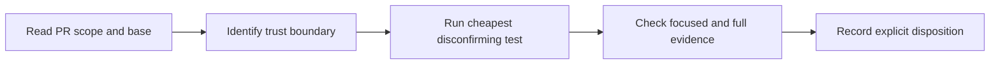

# Reviewing agent-governance changes

This is a short, evidence-first playbook for independent maintainers reviewing
AGENTOWNERS. It is designed for a reviewer who has not followed the entire
implementation history. Read the changed files and the linked specification;
do not treat a green CI run as approval.

## Review sequence



1. Confirm the PR base is current and inspect the exact changed-file list.
2. Classify the change as core policy, CLI, Action adapter, release, example,
   or documentation. If it crosses boundaries, review each one separately.
3. Read the relevant spec and name the invariant the change must preserve.
4. Run the cheapest falsification test before spending time on broad review.
5. Verify focused evidence, then `pnpm verify`; inspect failures rather than
   accepting a rerun as proof.
6. Leave one explicit disposition using the template below.

## Boundary-specific checks

| Surface | First questions | Evidence that matters |
| --- | --- | --- |
| Core policy engine | Is `block > require_approval > allow` unchanged? Are unknown fields, empty conditions, secrets, and deterministic output still safe? | Focused unit test, adversarial fixture, and mutation-sensitive failure proof |
| CLI and Git | Are refs and paths treated as hostile? Are subprocesses argv-based? Does file creation avoid races and accidental overwrite? | Real argument parsing, exit-code assertions, hostile-ref tests, and filesystem boundary tests |
| GitHub Action | Is policy loaded from the immutable base? Are PR-file completeness, audit paths, and token permissions bounded? | Action tests, rebuilt committed bundle, and least-privilege review |
| Release and packages | Are versions aligned? Are generated artifacts current? Can local registry configuration redirect publication? | `pnpm verify:packages`, exact registry behavior, provenance/trusted-publishing proof |
| Examples and docs | Do commands, paths, profiles, and examples describe current behavior? Are examples executable rather than prose-only? | Parse/fixture validation, link checks, and a statement of unchanged product behavior |

## Cheapest useful tests

- A policy change: run the smallest relevant schema or evaluator test and
  mutate the decision branch temporarily. The test must fail under the mutation.
- A classifier or detector change: add the smallest adversarial filename or
  text input that could bypass the intended boundary.
- A CLI change: exercise the built CLI with an invalid ref, a hostile path, and
  each relevant exit-code branch.
- An Action or release change: inspect the generated bundle, permissions,
  registry selection, and package consumer behavior before reviewing prose.
- A documentation change: execute every changed command and resolve every
  changed local link.

## Disposition template

Copy this into the PR conversation and replace the bracketed fields:

```markdown
### Independent review disposition: [approve | request changes | rebase and retain | superseded | out of scope]

**Invariant:** [the exact behavior or security boundary reviewed]

**Evidence:**
- [focused test or executable reproduction]
- [full gate or hosted check]
- [mutation, adversarial case, or runtime proof]

**Finding:** [none, or the precise failure mechanism]

**Residual risk / limitation:** [what remains unknown or intentionally out of scope]
```

An `approve` disposition means the reviewer independently checked the boundary
and evidence. AI-assisted review, author self-review, a green check, or a
prepared evidence packet does not count as independent approval.

## Overlap and attribution

When another PR touches the same invariant, compare exact behavior before
closing or superseding it. Preserve distinct counterexamples, mutation tests,
compatibility findings, and attribution. Use `rebase and retain` when upstream
work should land first but the contribution contains evidence worth keeping.

## Join the review lane

The live queue is [Discussion #27](https://github.com/streamentry/AGENTOWNERS/discussions/27).
Choose one bounded lane, state what evidence you can independently check, and
leave the disposition on the PR. Vulnerability details belong in the
[private security advisory channel](../SECURITY.md), not in a public issue.
