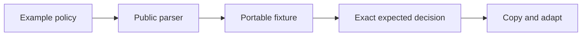
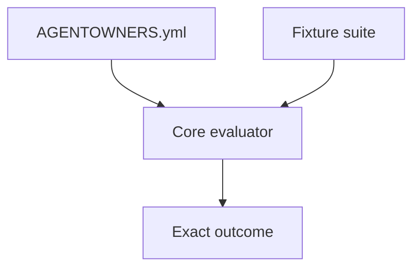
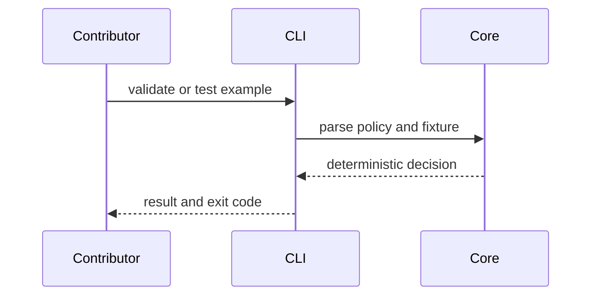

# Policy examples

## Overview

This folder contains copyable policies and portable fixtures that demonstrate
the public AGENTOWNERS contract. Examples must remain conservative, parse
through the public API, and state their intended risk posture.

## Key components

- `minimal/`: permissive starting policy
- `strict-oss/`: open-source policy with executable fixtures
- `security-sensitive/`: fail-closed security policy
- `monorepo/`: package-scoped review example
- `dependency-bots/`: explicit Dependabot and Renovate mapping

## Verification

Run `pnpm verify` after changing an example. If a fixture changes, prove the
exact expected decision with `agentowners test`; do not rely on prose alone.

