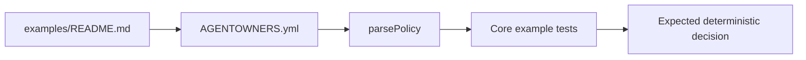
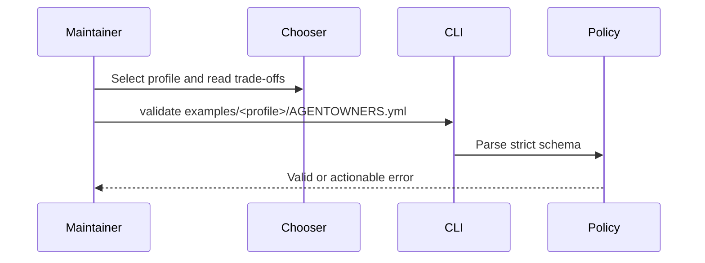

# Policy Examples

## Overview

This directory contains small, checked-in `AGENTOWNERS.yml` policies that are
parsed by the core test suite. They demonstrate conservative starting points;
they are not universal security baselines.

## Key Components

- `minimal/` — smallest useful policy for evaluation.
- `strict-oss/` — open-source defaults plus a portable fixture contract.
- `security-sensitive/` — fail-closed defaults for protected code paths.
- `monorepo/` — package-oriented ownership and reviewer routing.
- `dependency-bots/` — explicit Dependabot and Renovate boundaries.
- `README.md` — chooser, trade-offs, and executable validation commands.

Keep example policy semantics deterministic. If an example changes, update its
focused tests or fixtures and state the changed decision boundary in the PR.

## Diagrams

## Verification

From the repository root, run `pnpm build`, validate every example with the
CLI, and execute the strict-OSS fixture suite. Do not claim an example is
safe merely because it parses; inspect its decisions against the target
repository and configure real reviewer identities.
