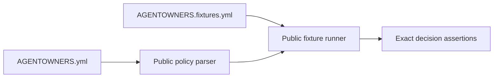

# Policy examples

## Overview

The `examples/` directory contains copyable policy profiles and their portable
decision contracts. Examples are user-facing documentation and executable
regression evidence, not generic templates with hidden defaults.

## Contract

Every example directory must contain exactly one `AGENTOWNERS.yml` and one
`AGENTOWNERS.fixtures.yml`. The fixture suite must run through the public
`parsePolicyFixtureSuite()` and `runPolicyFixtureSuite()` APIs and assert the
profile's documented decisions. Keep fixtures deterministic, repository
relative, and free of secrets.

## Verification

Run the focused example test before the repository gate:

```bash
pnpm --filter @agent-owners/core test -- packages/core/tests/examples.test.ts
pnpm verify
```

When changing a profile, update its policy and fixtures together. Preserve
fail-closed sensitive defaults and explain any intentional decision change in
the pull request.


