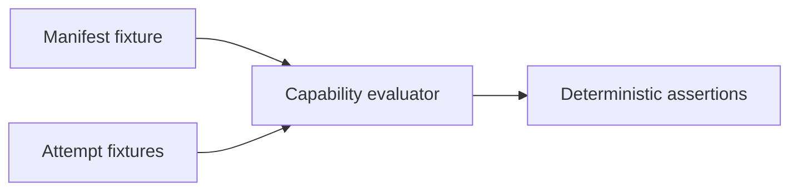

# Fixtures

## Overview

Fixtures are portable, checked-in inputs for deterministic verification. They
must contain synthetic identities and scopes only. Never add live credentials,
tokens, private endpoints, or production data.

## Key components

- `capabilities/AGENT_CAPABILITIES.json` is the v1 capability manifest.
- `capabilities/attempts.json` contains expected allow/deny requests.

