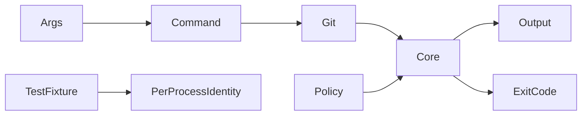
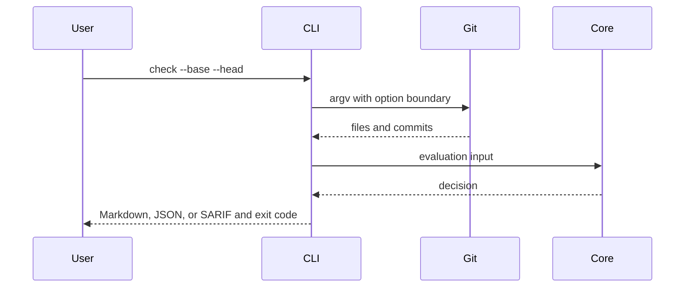
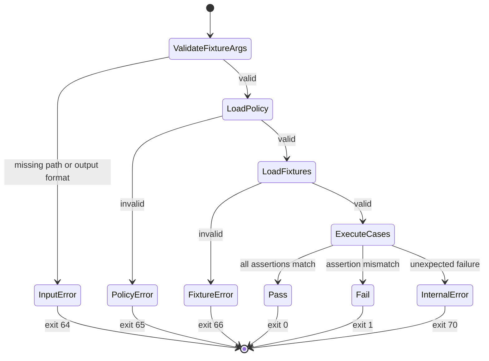
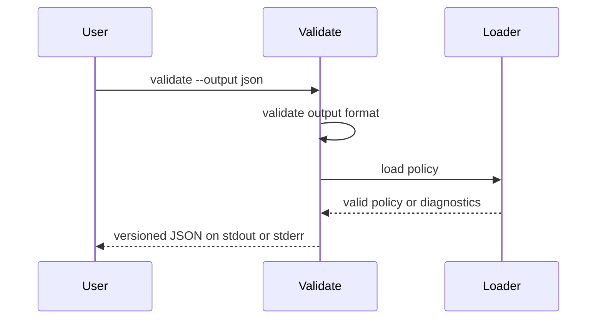
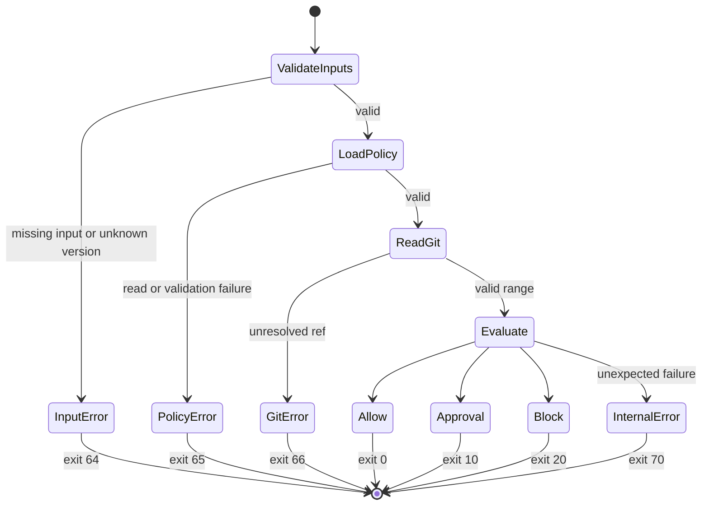

# CLI

## Overview

The CLI adapts local Git state to the pure core engine. Git refs are untrusted
input and must be passed as argv through `execFileSync`, never through a shell.
Place refs after `--end-of-options`; argv separation alone does not stop Git
from interpreting a ref that begins with `-` as an option.

## Key components

- `src/git.ts`: bounded Git subprocess adapter
- `src/commands/init.ts`: profile installation
- `src/commands/validate.ts`: schema diagnostics with text and versioned JSON
  output; JSON errors must not echo policy contents or absolute paths
- `src/commands/check.ts`: local policy evaluation
- `src/commands/explain.ts`: decision explanation
- `src/commands/fingerprint.ts`: agent-signal inspection
- `src/commands/self-check.ts`: versioned machine-readable pre-PR contract
- `src/commands/test.ts`: portable policy fixture execution

## Diagrams

`test` reads explicit policy and fixture paths. It does not inspect Git state
or infer missing inputs.

`validate --output json` is a side-effect-free machine contract: valid results
go to stdout, invalid results go to stderr, and unsupported formats fail before
the policy loader runs. Text diagnostics preserve YAML line and column context
without echoing malformed policy source snippets. Schema diagnostics must also
redact received values while retaining field paths.

`self-check` follows the same sequence but requires explicit policy, base,
head, and actor inputs. It returns JSON only and never infers identity.

## Verification

Run `pnpm --filter @agent-owners/cli test`, `pnpm build`, and
`pnpm verify:release`.
Temporary Git fixtures must pass author and committer identity through the
single commit subprocess environment. Never use `git config` in tests.
Unknown output formats must fail before reading Git.
