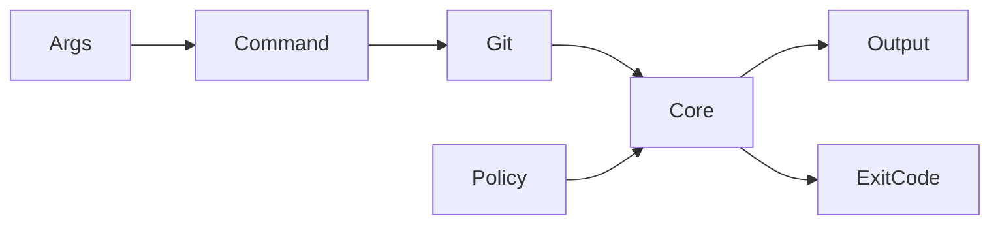
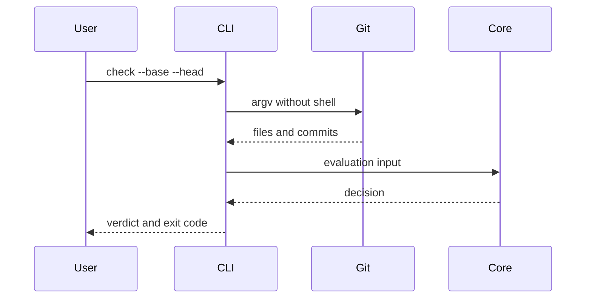

# CLI

## Overview

The CLI adapts local Git state to the pure core engine. Git refs are untrusted
input and must be passed as argv through `execFileSync`, never through a shell.

## Key components

- `src/git.ts`: bounded Git subprocess adapter
- `src/commands/init.ts`: profile installation
- `src/commands/validate.ts`: schema diagnostics
- `src/commands/check.ts`: local policy evaluation
- `src/commands/explain.ts`: decision explanation
- `src/commands/fingerprint.ts`: agent-signal inspection

## Diagrams

## Verification

Run `pnpm --filter @agent-owners/cli test`, `pnpm build`, and
`pnpm verify:release`.
