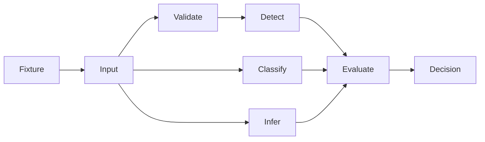
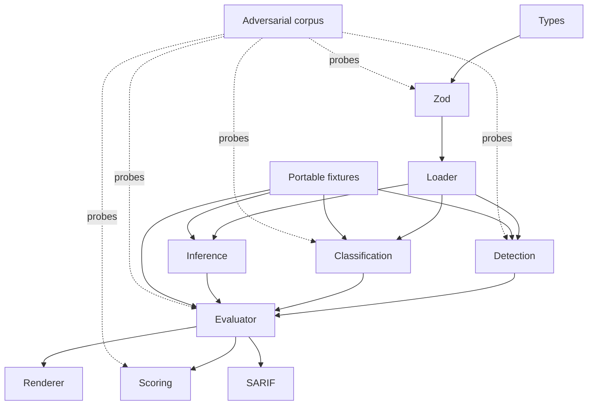
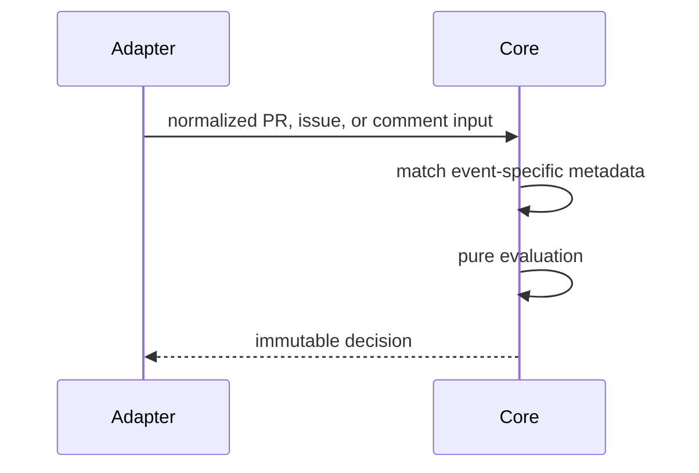
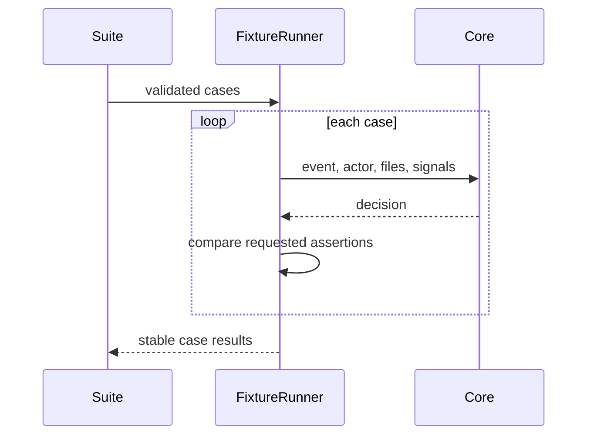

# Core policy engine

## Overview

Pure, deterministic policy evaluation. No filesystem writes, shell commands,
network calls, clocks, randomness, or persistent state.

## Key components

- `types.ts`: public contract
- `schema.ts`: untrusted YAML validation
- `json-schema.ts`: deterministic authoring schema derived from Zod
- `classifier.ts`: repository-depth-independent path and secret classification
- `detection.ts`: actor, commit, PR, issue, and comment evidence
- `actions.ts`: event-to-action inference
- `evaluator.ts`: event-specific rule matching, precedence, and decision construction
- `scoring.ts`: deterministic risk score
- `renderer.ts`: Markdown and audit output
- `tests/custom-agents.test.ts`: repository custom-agent privilege contracts
- `tests/repository-policies.test.ts`: repository policy templates stay schema-valid
- `fixtures.ts`: strict portable suites and assertion comparison
- `sarif.ts`: deterministic SARIF 2.1.0 output

## Diagrams

## Verification

Run `pnpm --filter @agent-owners/core test` and `pnpm typecheck`.
Custom-agent changes must keep `tests/custom-agents.test.ts` green.
After changing policy validation, run `pnpm generate:schema` and commit the
generated `agentowners.schema.json`.
For safety invariants, add a case to the adversarial corpus and prove it fails
under a temporary relevant mutation before restoring production code.
SARIF output must never contain timestamps, absolute paths, or unstable rule
identifiers.
