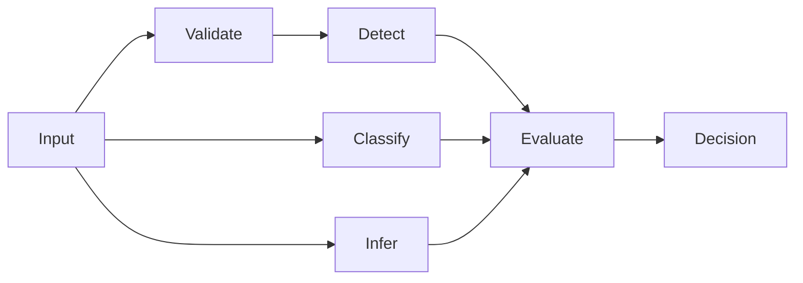
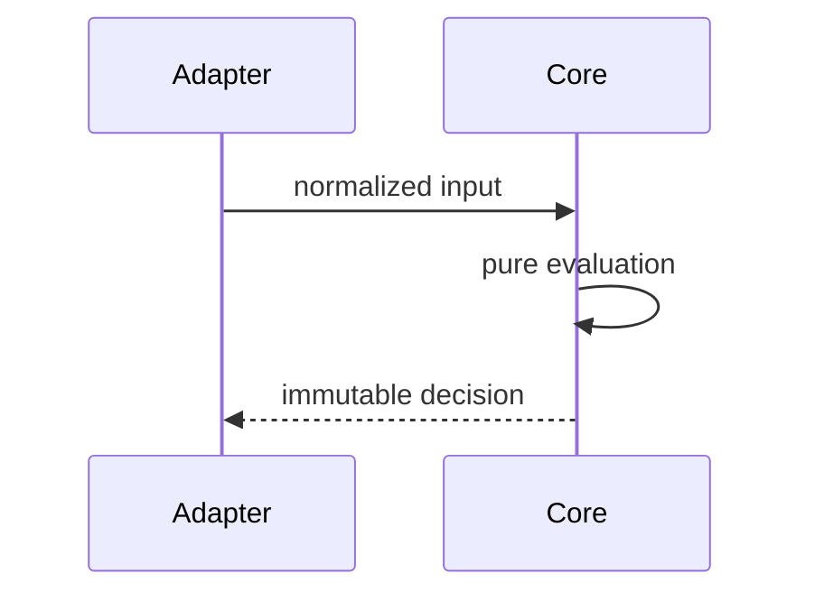

# Core policy engine

## Overview

Pure, deterministic policy evaluation. No filesystem writes, shell commands,
network calls, clocks, randomness, or persistent state.

## Key components

- `types.ts`: public contract
- `schema.ts`: untrusted YAML validation
- `json-schema.ts`: deterministic authoring schema derived from Zod
- `classifier.ts`: path and secret classification
- `detection.ts`: agent evidence
- `actions.ts`: event-to-action inference
- `evaluator.ts`: precedence and decision construction
- `scoring.ts`: deterministic risk score
- `renderer.ts`: Markdown and audit output

## Diagrams

## Verification

Run `pnpm --filter @agent-owners/core test` and `pnpm typecheck`.
After changing policy validation, run `pnpm generate:schema` and commit the
generated `agentowners.schema.json`.
