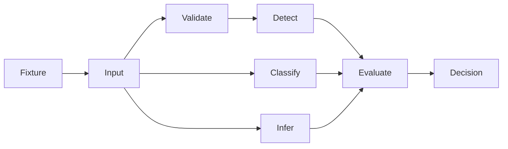
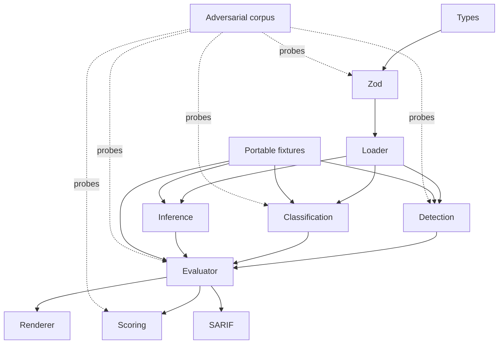
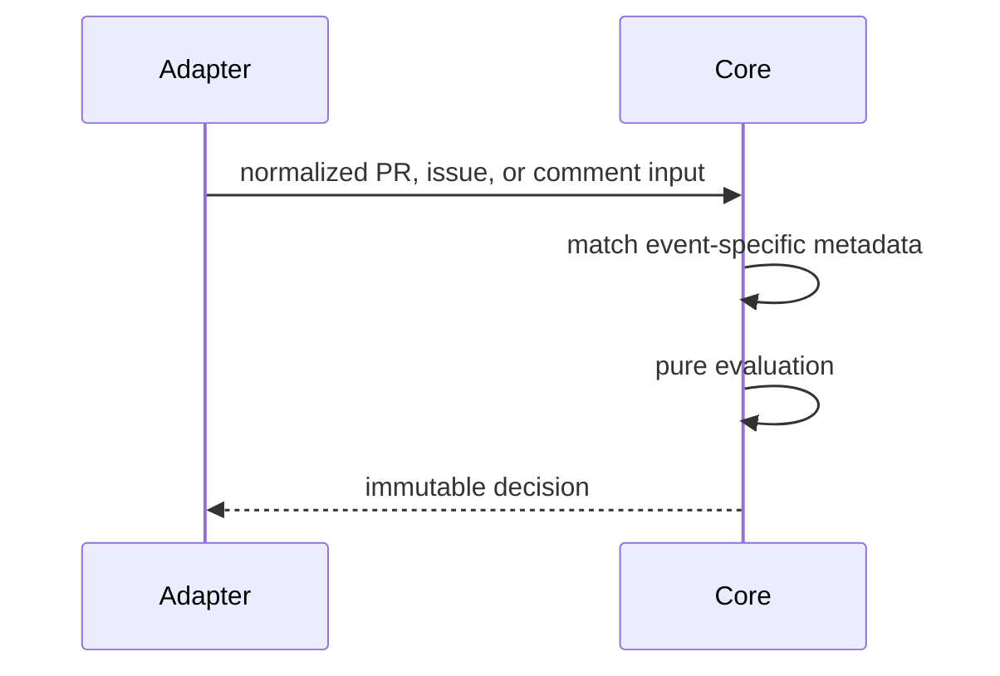
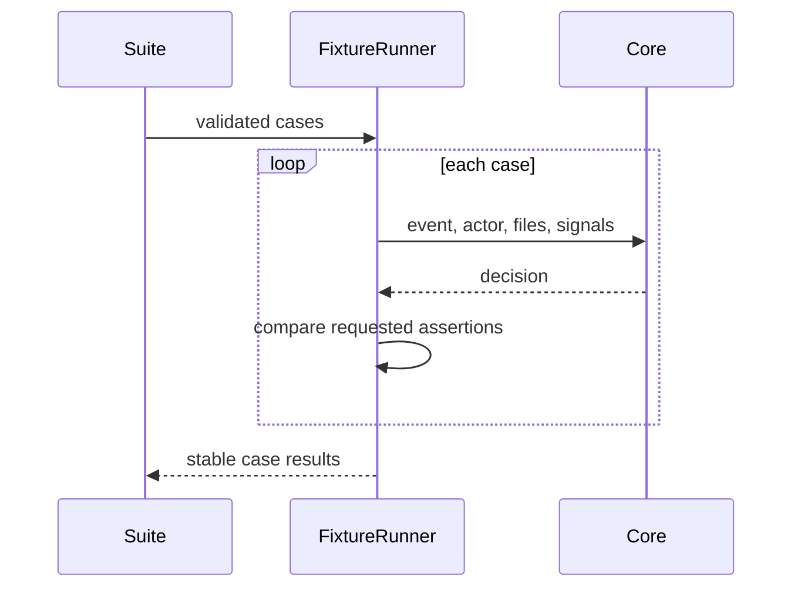

# Core policy engine

## Overview

Pure, deterministic policy evaluation. No filesystem writes, shell commands,
network calls, clocks, randomness, or persistent state.

## Key components

- `types.ts`: public contract
- `schema.ts`: untrusted YAML validation
- `json-schema.ts`: deterministic authoring schema derived from Zod
- `classifier.ts`: path and secret classification
- `detection.ts`: actor, commit, PR, issue, and comment evidence
- `actions.ts`: event-to-action inference
- `evaluator.ts`: event-specific rule matching, precedence, and decision construction
- `scoring.ts`: deterministic risk score
- `renderer.ts`: Markdown and audit output, including optional policy evidence
- `tests/custom-agents.test.ts`: repository custom-agent privilege contracts
- `fixtures.ts`: strict portable suites and assertion comparison
- `sarif.ts`: deterministic SARIF 2.1.0 output
- `capabilities.ts`: strict pre-dispatch capability validation, evaluation, and
  hash-chained audit output; no filesystem, network, or dispatch side effects
- `policy-diff.ts`: canonical policy fingerprints and value-free structural
  diffs; no filesystem, network, or policy-value output
- `tests/repository-policy.test.ts`: strict-schema regression coverage for the
  repository's checked-in policy and copyable policy template

Configured agent labels are candidate identity signals, not confirmed
identity. Keep `agents[name].match.labels` wired through `detectAgent()` while
preserving `possible` confidence so a mutable label cannot authorize an
otherwise unknown action. Blocking and approval rules may still fail closed.
The same conservative boundary applies to configured body/title patterns:
they are `likely`, while explicit actors and built-in verified bot actors are
the only confirmed identity paths. In `evaluateRule`, `when.agents` may route
`block` or `require_approval` for candidate identities, but an `allow` rule
requires `confirmed` confidence; use `when.actors` for explicit actor policy.

## Diagrams

## Verification

Run `pnpm --filter @agent-owners/core test` and `pnpm typecheck`.
Capability contract changes must keep `capabilities.test.ts` and the checked-in
identity-bound fixture behavior deterministic.
Custom-agent changes must keep `tests/custom-agents.test.ts` green.
Policy-diff changes must keep `tests/policy-diff.test.ts` deterministic and
must not add policy values to the diff contract. Structural changes must stay
aligned with the digest's canonicalization, including omitted undefined
optional fields.
Repository policy template changes must keep `tests/repository-policy.test.ts`
green so copyable configuration cannot drift from the strict schema.
After changing policy validation, run `pnpm generate:schema` and commit the
generated `agentowners.schema.json`.
For safety invariants, add a case to the adversarial corpus and prove it fails
under a temporary relevant mutation before restoring production code.
SARIF output must never contain timestamps, absolute paths, or unstable rule
identifiers.
