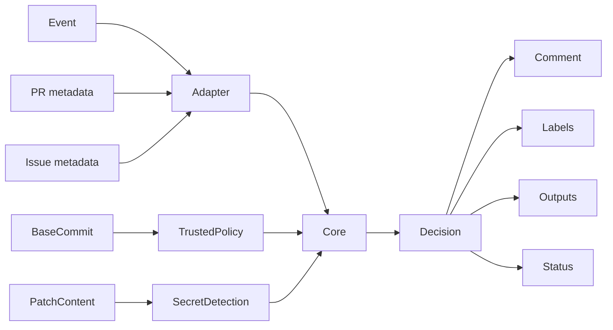
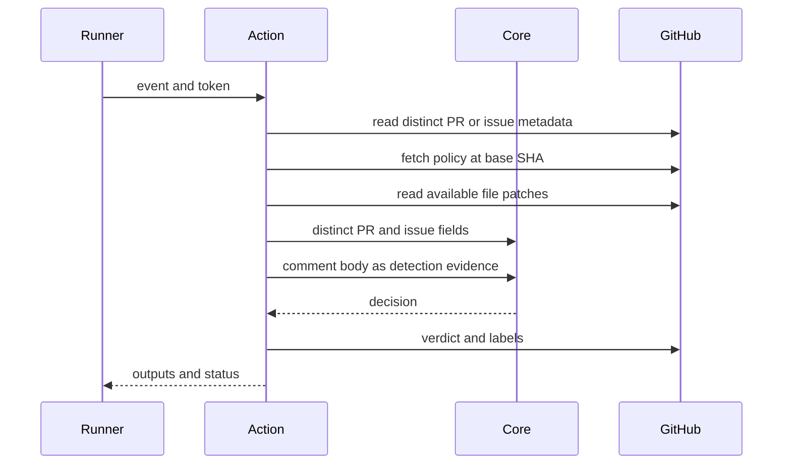

# GitHub Action

## Overview

The Action adapts GitHub events and API data to the core engine, then applies
explicitly configured effects. The bundled `dist/index.js` is a release
artifact and must be regenerated, never hand-edited.

## Key components

- `src/index.ts`: orchestration and outputs
- `src/github.ts`: event metadata adapter, including paginated PR commit authors
- `src/policy.ts`: repository-relative policy validation and trusted-ref loading
- `src/comment.ts`: sticky verdict upsert
- `src/config.ts`: fail-closed runtime input validation, including the
  documented action modes
- `action.yml`: package-local metadata
- `dist/index.js`: committed Node 24 bundle

## Diagrams

## Verification

Run `pnpm --filter @agent-owners/github-action test`, `pnpm build`, and
`pnpm verify:release`. Pull-request commit-author fields must remain paginated
and distinct from issue/comment metadata. Pass the core detector's
`identityTrust` into audit output so reviewers can distinguish authenticated
actors from spoofable commit, label, title, and body evidence.

Action inputs must fail closed: an unknown `mode` or boolean value is an error,
never a silent no-op that bypasses comments or enforcement. Label lifecycle
tests must prove stale managed risk labels are removed while unrelated labels
remain untouched.

Unsupported webhook actions must warn and stop before repository metadata is
read; never coerce an unknown action into `opened` or another decision-bearing
event.
Sticky verdict reconciliation must require the complete opening and closing
markers in the expected positions; never overwrite a comment that merely quotes
or partially contains the marker.
