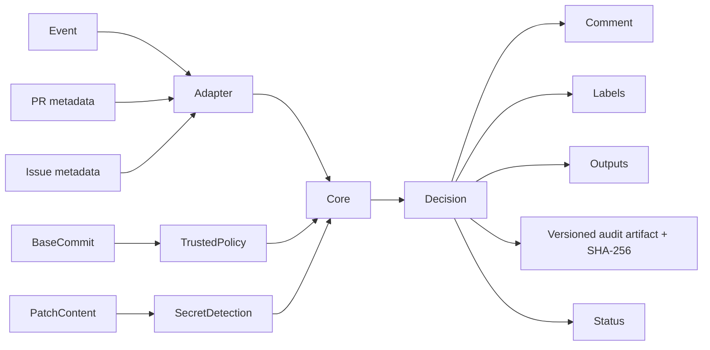
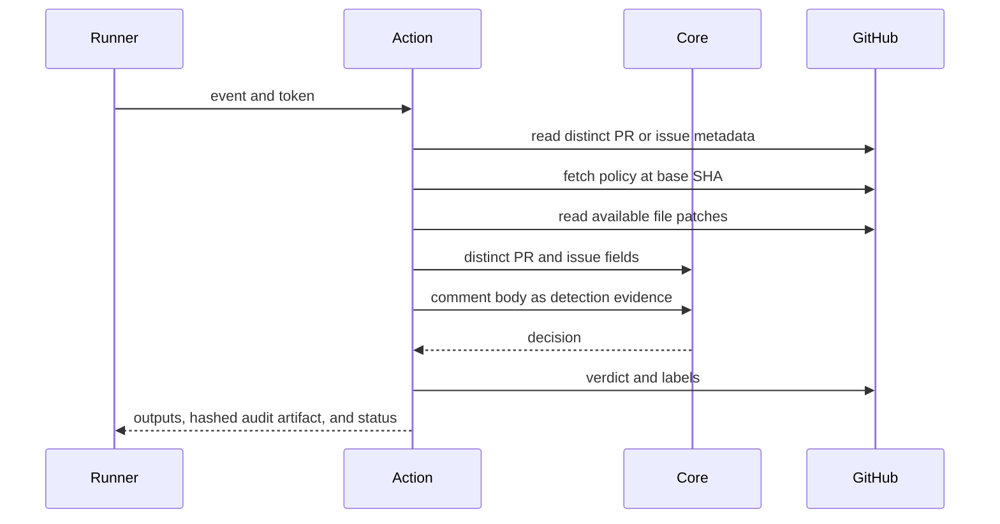

# GitHub Action

## Overview

The Action adapts GitHub events and API data to the core engine, then applies
explicitly configured effects. The bundled `dist/index.js` is a release
artifact and must be regenerated, never hand-edited.

## Key components

- `src/index.ts`: orchestration and outputs
- `src/github.ts`: event metadata adapter
- `src/policy.ts`: repository-relative policy validation and trusted-ref loading
- `src/comment.ts`: sticky verdict upsert
- `src/config.ts`: fail-closed runtime input validation
- `action.yml`: package-local metadata
- `dist/index.js`: committed Node 24 bundle

## Diagrams

## Verification

Run `pnpm --filter @agent-owners/github-action test`, `pnpm build`, and
`pnpm verify:release`.
