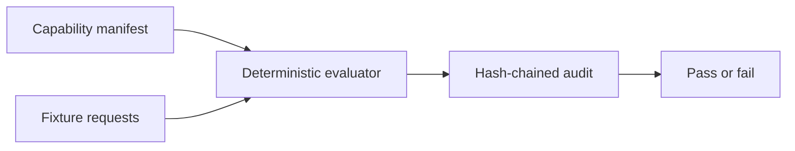

# Scripts

## Overview

Repository verification and deterministic release helpers live here. Scripts
must use Node built-ins or pinned repository dependencies, fail closed, and
avoid network or secret side effects unless their contract explicitly says so.

## Key components

- `capability-demo.mjs` evaluates the example capability manifest, emits a
  hash-chained audit through the built core API and performs no external
  dispatch.
- `marketplace-metadata.mjs` verifies root and package Action metadata parity.
- `marketplace-metadata.test.mjs` covers metadata drift and malformed input.
- `release-automation.mjs` contains tested, argv-based idempotent publication
  and major-tag primitives.
- `release-automation.test.mjs` covers registry ambiguity, ordering, and tag
  safety.
- `publish-packages.mjs` and `update-major-tag.mjs` are release entry points;
  they are not invoked by the current protected workflow until a maintainer
  integrates and reviews that change.
- `verify-release.mjs` and `verify-packed-packages.mjs` check release artifacts.
  The packed consumer smoke test also exercises the installed value-free
  `policy-diff` contract.

## Flow

Run `pnpm test:capabilities` after changing the capability demo.

Marketplace checks are offline evidence only. They cannot prove owner
agreement, category selection, 2FA, or public Marketplace publication.

Run `pnpm test:release` after changing release helpers. Never pass policy or
user-controlled text through a shell, and never treat an npm error other than
an exact all-`E404` lookup as proof that a package is absent.
