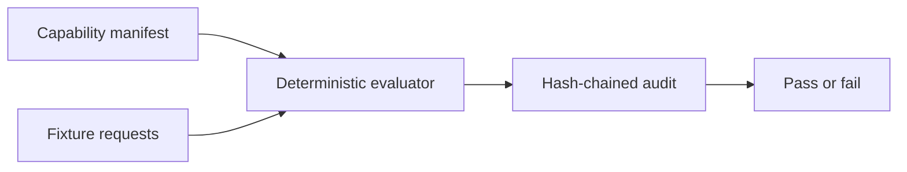

# Scripts

## Overview

Repository verification and deterministic release helpers live here. Scripts
must use Node built-ins or pinned repository dependencies, fail closed, and
avoid network or secret side effects unless their contract explicitly says so.

## Key components

- `capability-demo.mjs` evaluates the example capability manifest, emits a
  hash-chained audit, and performs no external dispatch.
- `marketplace-metadata.mjs` verifies root and package Action metadata parity.
- `marketplace-metadata.test.mjs` covers metadata drift and malformed input.
- `verify-release.mjs` and `verify-packed-packages.mjs` check release artifacts.

## Flow

Run `pnpm test:capabilities` after changing the capability demo.

Marketplace checks are offline evidence only. They cannot prove owner
agreement, category selection, 2FA, or public Marketplace publication.
