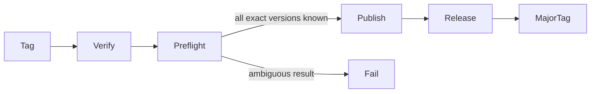
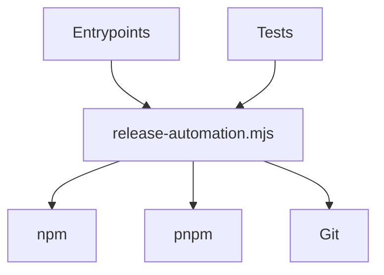
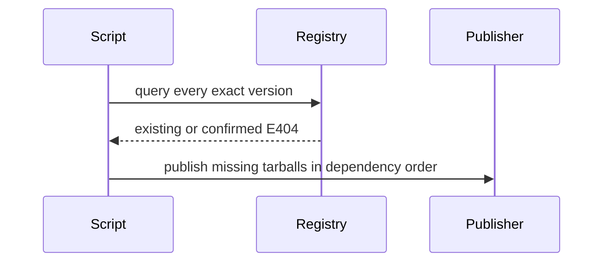

# Release and Verification Scripts

## Overview

Scripts are deterministic repository tooling. Release scripts separate
read-only preflight from registry and Git tag mutations, use argv-based process
execution, and must remain independently testable without network access.

## Key Components

- `release-automation.mjs`: tested publication and tag primitives
- `release-automation.test.mjs`: failure-ordering and command-boundary tests
- `publish-packages.mjs`: release workflow package entry point
- `update-major-tag.mjs`: stable Action tag entry point
- `verify-release.mjs`: built artifact and version validation
- `verify-packed-packages.mjs`: isolated consumer smoke tests

## Diagrams (Mermaid)

### Flowchart

### Component Diagram

### Sequence Diagram

## Invariants

- Never treat authentication, network, server, or malformed output as absence.
- Complete all registry lookups before the first publish.
- Use pnpm only to rewrite and pack workspace dependencies.
- Use npm 11.5.1 or newer for trusted OIDC publication.
- Never move a stable major tag for a prerelease.
- Never pass policy-controlled or user-controlled text through a shell.
- Packed-package verification must not read or write the user's global npm
  cache.
