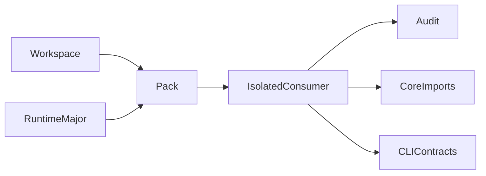
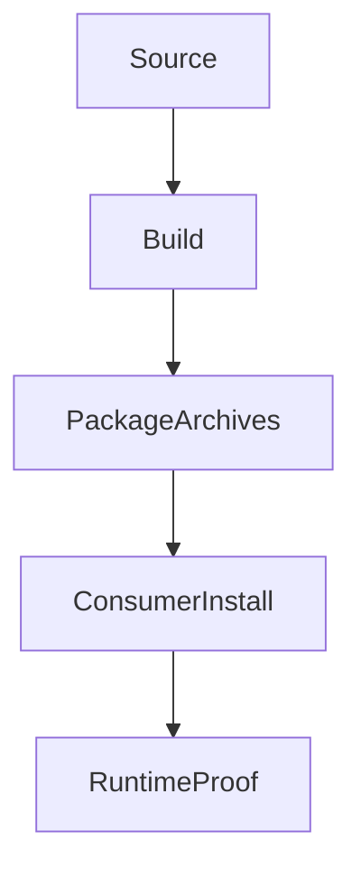
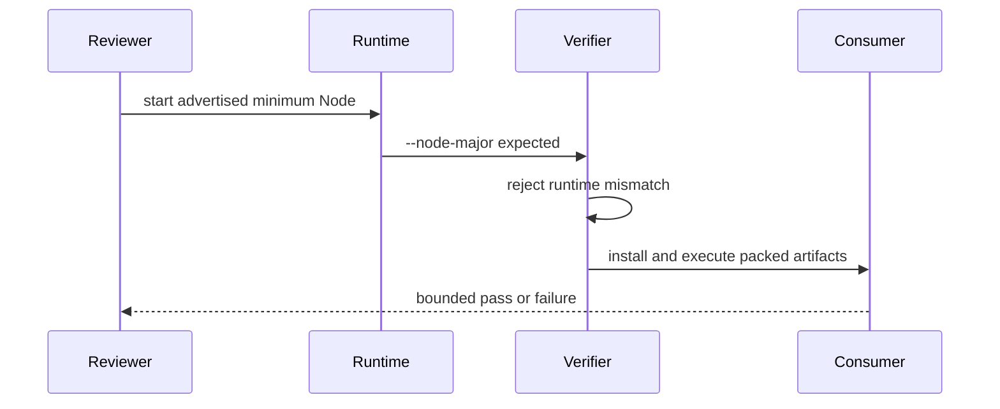

# Release Verification Scripts

## Overview

Release scripts prove generated artifacts and packed consumer behavior without
changing policy semantics. Compatibility claims require execution under the
actual advertised runtime, not a spoofed version string.

## Key Components

- `verify-release.mjs`: package metadata, exports, CLI, Action runtime, and
  committed-bundle checks, including proof that the packed verifier rejects a
  mismatched runtime and package Node engine drift
- `verify-packed-packages.mjs`: isolated npm installation, audit, CommonJS and
  ESM imports, schema export, and CLI command contracts
- `generate-json-schema.mjs`: deterministic policy-schema generation and drift
  verification

## Diagrams

## Verification

Run `pnpm verify` under the contributor runtime. Run
`pnpm verify:packages:node22` only from an actual Node 22 process. A pass under
a newer runtime does not prove the minimum consumer contract.
