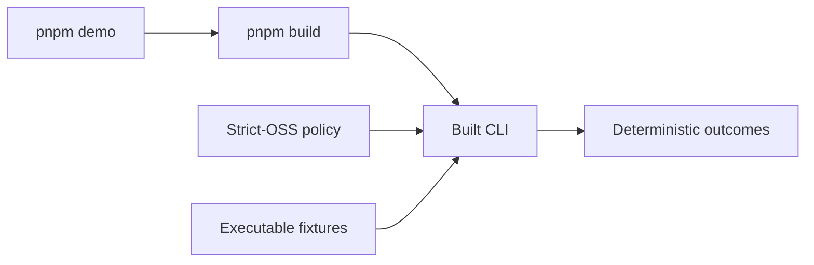

# Repository scripts

## Overview

This directory contains deterministic repository tooling. Scripts may invoke
the built CLI or validate generated artifacts, but they must not add network,
clock, randomness, credentials, or policy execution side effects.

## Key components

- `demo.mjs` runs the production CLI against the strict-OSS example fixtures.
- `verify-release.mjs` validates generated package and Action release artifacts.
- `verify-packed-packages.mjs` tests isolated packed-package consumers.
- `verify-doc-links.mjs` checks repository documentation links.

## Diagram

