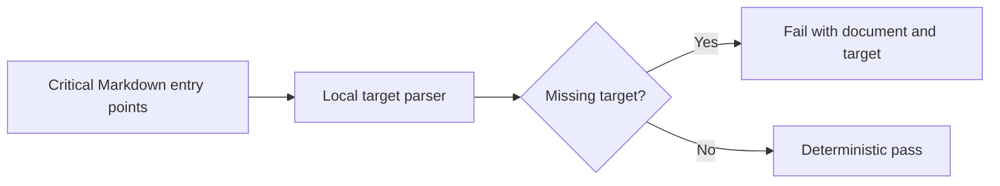

# Verification Scripts

## Overview

Scripts in this folder are release, schema, package, or documentation gates.
They must fail loudly, avoid network assumptions unless explicitly documented,
and never execute repository policy content as code.

## Key components

- `generate-json-schema.mjs`: checks the committed schema artifact
- `verify-release.mjs`: checks package metadata and committed release artifacts
- `verify-packed-packages.mjs`: installs packed packages in an isolated consumer
- `verify-docs.mjs`: checks local links and image targets in critical entry docs
- `verify-docs.test.mjs`: dependency-free contract tests for the docs checker

## Verification flow

`verify-docs.mjs` ignores external URLs and does not make network requests.
Keep its document list explicit so adding a new gate surface is reviewable.

## Rules

- Use `pnpm verify` after changing a gate.
- Keep scripts shell-free with respect to untrusted input.
- Use temporary directories for consumer fixtures and clean them up.
- Do not hand-edit generated artifacts; regenerate them from source.
